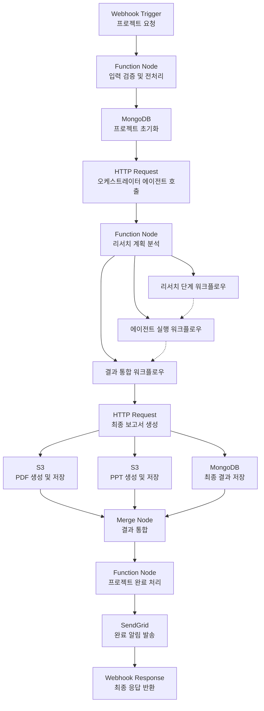
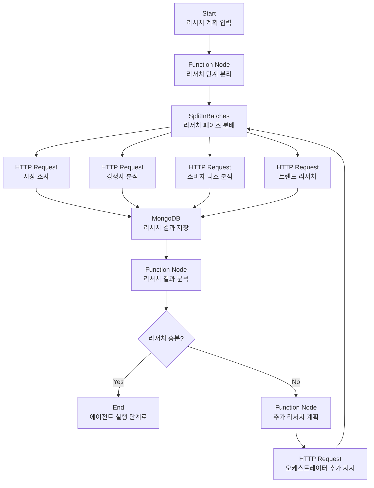
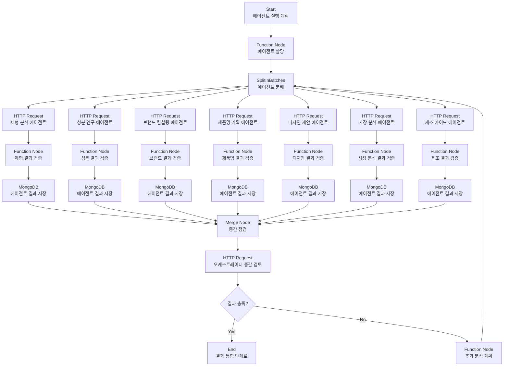
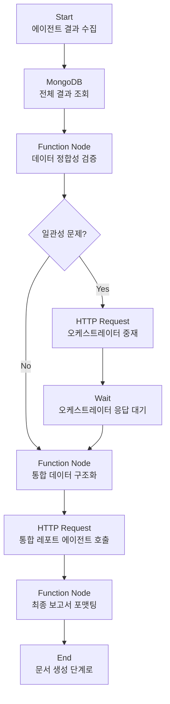
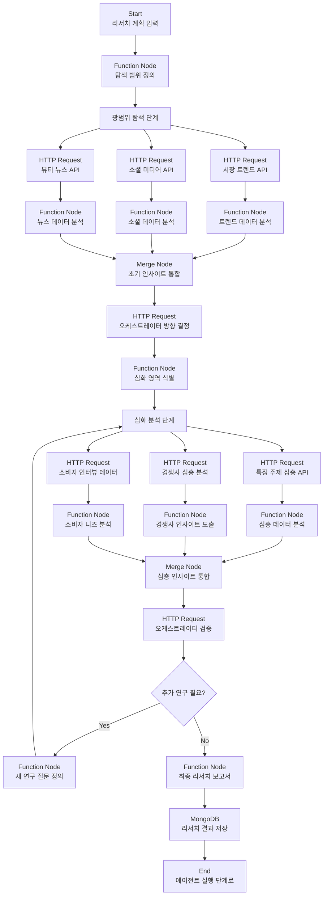
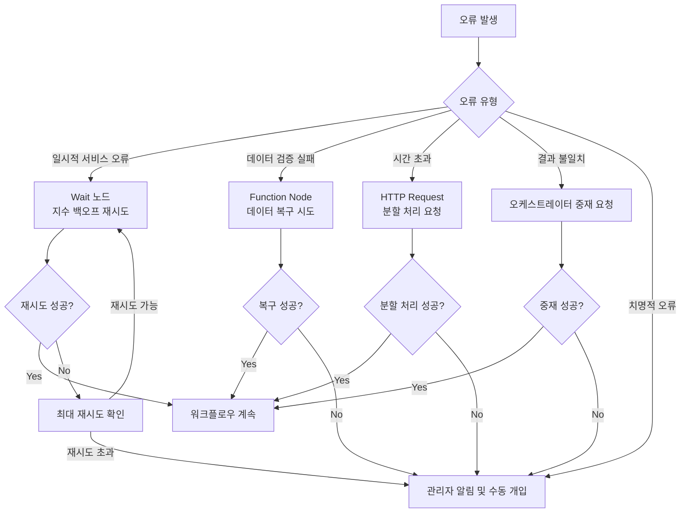
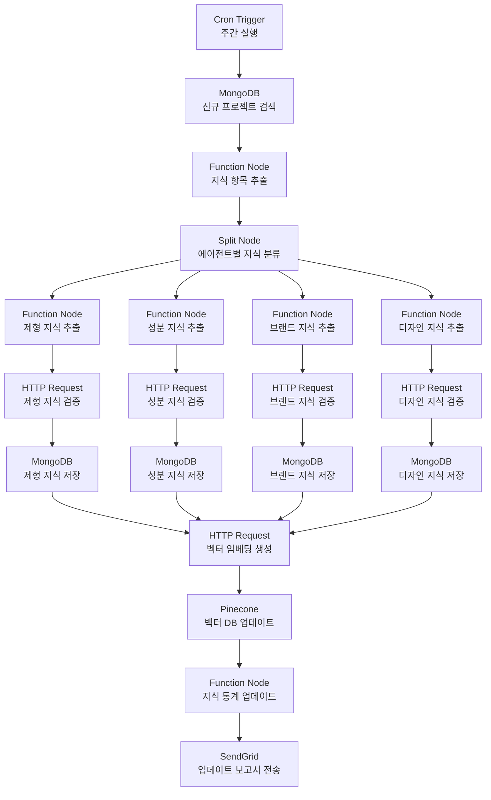
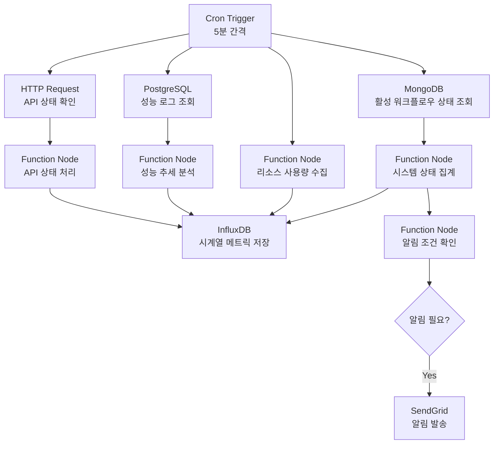
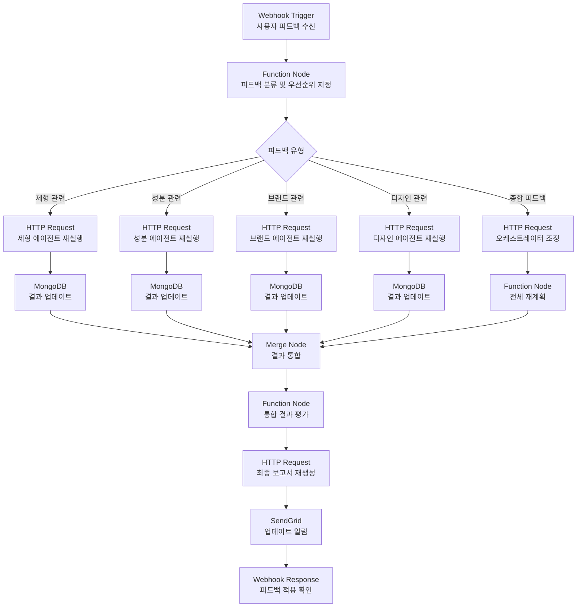

# 화장품 기획 시스템 n8n 워크플로우 상세 설계

## 1. 워크플로우 개요

n8n을 활용한 화장품 기획 시스템은 고객이 입력한 초기 프로젝트 정보를 바탕으로 오케스트레이터 에이전트의 지휘 하에 전문 에이전트 모듈을 실행하고, 최종 개발 기획 레포트를 생성하는 자동화된 프로세스입니다. 이 워크플로우는 깊이 있는 시장 리서치부터 상세한 제품 기획까지 전체 과정을 조율합니다.

## 2. 워크플로우 아키텍처 (확장)

### 2.1 메인 워크플로우 흐름



### 2.2 서브 워크플로우: 리서치 단계



### 2.3 서브 워크플로우: 에이전트 실행



### 2.4 서브 워크플로우: 결과 통합



## 3. 주요 노드 상세 설계 (확장)

### 3.1 오케스트레이터 호출 노드 (HTTP Request)

```json
{
  "parameters": {
    "method": "POST",
    "url": "https://api.yourdomain.com/agents/orchestrator",
    "authentication": "bearer",
    "sendHeaders": true,
    "headerParameters": {
      "parameters": [
        {
          "name": "Content-Type",
          "value": "application/json"
        }
      ]
    },
    "sendBody": true,
    "bodyParameters": {
      "parameters": [
        {
          "name": "project_id",
          "value": "={{ $node[\"입력 검증 노드\"].json[\"project_id\"] }}"
        },
        {
          "name": "project_name",
          "value": "={{ $node[\"입력 검증 노드\"].json[\"validated_input\"].project_name }}"
        },
        {
          "name": "initial_brief",
          "value": "={{ $node[\"입력 검증 노드\"].json[\"validated_input\"].initial_brief }}"
        },
        {
          "name": "depth_level",
          "value": "={{ $node[\"입력 검증 노드\"].json[\"validated_input\"].depth_level || 3 }}"
        },
        {
          "name": "focus_areas",
          "value": "={{ $node[\"입력 검증 노드\"].json[\"validated_input\"].focus_areas || [] }}"
        }
      ]
    },
    "options": {
      "response": {
        "response": {
          "fullResponse": false,
          "responseFormat": "json"
        }
      },
      "timeout": 300000
    }
  }
}
```

### 3.2 리서치 계획 분석 노드 (Function)

```javascript
// 오케스트레이터의 리서치 계획 분석
function analyzeResearchPlan(items) {
  const orchestratorResult = items[0].json;
  const projectId = orchestratorResult.project_id;
  const plan = orchestratorResult.orchestration_plan;
  
  // 워크플로우 실행 계획 생성
  const researchPhases = plan.research_phases || [];
  const decisionPoints = plan.decision_points || [];
  const dependencies = plan.dependencies || [];
  
  // 실행 순서 계산
  const executionOrder = calculateExecutionOrder(researchPhases, dependencies);
  
  // 워크플로우 실행 플랜 생성
  return [{
    json: {
      project_id: projectId,
      workflow_plan: {
        research_phases: researchPhases,
        execution_order: executionOrder,
        decision_points: decisionPoints
      },
      research_summary: orchestratorResult.research_summary || {},
      integration_directives: orchestratorResult.integration_directives || {},
      execution_status: {
        current_phase: "research_planning",
        completed_phases: [],
        pending_phases: executionOrder,
        start_time: new Date().toISOString()
      }
    }
  }];
}

// 의존성에 기반한 실행 순서 계산 함수
function calculateExecutionOrder(phases, dependencies) {
  // 위상 정렬 알고리즘 구현
  // (간단한 구현을 위해 생략)
  return phases.map(phase => phase.phase_name);
}

return analyzeResearchPlan($input.all());
```

### 3.3 시장 조사 에이전트 호출 노드 (HTTP Request)

```json
{
  "parameters": {
    "method": "POST",
    "url": "https://api.yourdomain.com/agents/market-research",
    "authentication": "bearer",
    "sendHeaders": true,
    "headerParameters": {
      "parameters": [
        {
          "name": "Content-Type",
          "value": "application/json"
        }
      ]
    },
    "sendBody": true,
    "bodyParameters": {
      "parameters": [
        {
          "name": "project_id",
          "value": "={{ $node[\"리서치 계획 분석 노드\"].json[\"project_id\"] }}"
        },
        {
          "name": "research_phase",
          "value": "={{ $json[\"phase_name\"] }}"
        },
        {
          "name": "key_questions",
          "value": "={{ $json[\"key_questions\"] }}"
        },
        {
          "name": "focus_areas",
          "value": "={{ $json[\"focus_areas\"] }}"
        },
        {
          "name": "depth_level",
          "value": "={{ $node[\"리서치 계획 분석 노드\"].json[\"workflow_plan\"].depth_level || 3 }}"
        }
      ]
    },
    "options": {
      "response": {
        "response": {
          "fullResponse": false,
          "responseFormat": "json"
        }
      },
      "timeout": 180000
    }
  }
}
```

### 3.4 리서치 결과 분석 노드 (Function)

```javascript
// 리서치 결과 충분성 평가
function analyzeResearchResults(items) {
  const researchResults = items.map(item => item.json);
  const projectId = researchResults[0].project_id;
  
  // 신뢰도 및 완전성 점수 계산
  let confidenceScores = {};
  let completenessScores = {};
  
  // 리서치 결과별 평가
  for (const result of researchResults) {
    const phase = result.research_phase;
    confidenceScores[phase] = calculateConfidenceScore(result);
    completenessScores[phase] = calculateCompletenessScore(result);
  }
  
  // 전체 리서치의 충분성 평가
  const overallConfidence = calculateOverallScore(confidenceScores);
  const overallCompleteness = calculateOverallScore(completenessScores);
  const isResearchSufficient = overallConfidence >= 7 && overallCompleteness >= 8;
  
  // 추가 리서치 필요 영역 식별
  const areasNeedingMoreResearch = [];
  for (const phase in confidenceScores) {
    if (confidenceScores[phase] < 6 || completenessScores[phase] < 7) {
      areasNeedingMoreResearch.push(phase);
    }
  }
  
  return [{
    json: {
      project_id: projectId,
      research_evaluation: {
        overall_confidence: overallConfidence,
        overall_completeness: overallCompleteness,
        is_sufficient: isResearchSufficient,
        areas_needing_more_research: areasNeedingMoreResearch
      },
      research_results: researchResults,
      proceed_to_agents: isResearchSufficient
    }
  }];
}

// 신뢰도 점수 계산 (예시)
function calculateConfidenceScore(result) {
  // 리서치 결과의 품질, 출처 신뢰성, 데이터 일관성 등 평가
  // (간단한 구현을 위해 생략)
  return Math.floor(Math.random() * 3) + 7; // 7-9 점 예시
}

// 완전성 점수 계산 (예시)
function calculateCompletenessScore(result) {
  // 핵심 질문 답변 여부, 범위 충족 여부 등 평가
  // (간단한 구현을 위해 생략)
  return Math.floor(Math.random() * 3) + 7; // 7-9 점 예시
}

// 전체 점수 계산
function calculateOverallScore(scores) {
  if (Object.keys(scores).length === 0) return 0;
  
  const sum = Object.values(scores).reduce((a, b) => a + b, 0);
  return sum / Object.keys(scores).length;
}

return analyzeResearchResults($input.all());
```

### 3.5 에이전트 할당 노드 (Function)

```javascript
// 오케스트레이터 지시에 따른 에이전트 할당
function assignAgents(items) {
  const orchestratorResult = items[0].json;
  const projectId = orchestratorResult.project_id;
  const researchResults = orchestratorResult.research_results;
  const integrationDirectives = orchestratorResult.integration_directives || {};
  
  // 에이전트별 입력 데이터 준비
  const agents = [
    {
      agent_type: "formulation",
      input_data: prepareFormulationInput(researchResults, integrationDirectives)
    },
    {
      agent_type: "ingredients",
      input_data: prepareIngredientsInput(researchResults, integrationDirectives)
    },
    {
      agent_type: "brand",
      input_data: prepareBrandInput(researchResults, integrationDirectives)
    },
    {
      agent_type: "naming",
      input_data: prepareNamingInput(researchResults, integrationDirectives)
    },
    {
      agent_type: "design",
      input_data: prepareDesignInput(researchResults, integrationDirectives)
    },
    {
      agent_type: "market",
      input_data: prepareMarketInput(researchResults, integrationDirectives)
    },
    {
      agent_type: "manufacturing",
      input_data: prepareManufacturingInput(researchResults, integrationDirectives)
    }
  ];
  
  // 각 에이전트에 공통 필드 추가
  agents.forEach(agent => {
    agent.input_data.project_id = projectId;
    agent.input_data.research_focus = integrationDirectives.priority_elements?.find(
      e => e.relates_to === agent.agent_type
    )?.focus_area || "";
  });
  
  return agents.map(agent => ({
    json: {
      project_id: projectId,
      agent_type: agent.agent_type,
      input_data: agent.input_data
    }
  }));
}

// 각 에이전트별 입력 데이터 준비 함수들
function prepareFormulationInput(research, directives) {
  // 리서치 결과에서 제형 관련 데이터 추출
  // (간단한 구현을 위해 기본 구조만 제공)
  return {
    formulation_type: extractFormulationType(research),
    preferences: extractFormulationPreferences(research),
    target_audience: extractTargetAudience(research),
    market_context: extractMarketContext(research)
  };
}

// 다른 에이전트 입력 준비 함수들도 유사하게 구현
// (brevity를 위해 생략)

// 리서치 결과에서 데이터 추출 헬퍼 함수들
function extractFormulationType(research) {
  // 리서치 결과에서 제형 타입 추출 로직
  return research.find(r => r.category === 'product_preferences')?.formulation_type || "크림";
}

function extractFormulationPreferences(research) {
  // 리서치 결과에서 제형 선호도 추출 로직
  return research.find(r => r.category === 'product_preferences')?.formulation_preferences || [];
}

function extractTargetAudience(research) {
  // 리서치 결과에서 타겟 고객층 추출 로직
  return research.find(r => r.category === 'market_analysis')?.target_audience || "";
}

function extractMarketContext(research) {
  // 리서치 결과에서 시장 맥락 추출 로직
  return research.find(r => r.category === 'market_analysis')?.market_context || "";
}

return assignAgents($input.all());
```

### 3.6 오케스트레이터 중간 검토 노드 (HTTP Request)

```json
{
  "parameters": {
    "method": "POST",
    "url": "https://api.yourdomain.com/agents/orchestrator/review",
    "authentication": "bearer",
    "sendHeaders": true,
    "headerParameters": {
      "parameters": [
        {
          "name": "Content-Type",
          "value": "application/json"
        }
      ]
    },
    "sendBody": true,
    "bodyParameters": {
      "parameters": [
        {
          "name": "project_id",
          "value": "={{ $node[\"중간 점검 노드\"].json[\"project_id\"] }}"
        },
        {
          "name": "current_results",
          "value": "={{ $node[\"중간 점검 노드\"].json[\"agent_results\"] }}"
        },
        {
          "name": "current_phase",
          "value": "agent_execution"
        },
        {
          "name": "review_type",
          "value": "interim"
        }
      ]
    },
    "options": {
      "response": {
        "response": {
          "fullResponse": false,
          "responseFormat": "json"
        }
      },
      "timeout": 180000
    }
  }
}
```

### 3.7 통합 데이터 검증 노드 (Function)

```javascript
// 모든 에이전트 결과의 일관성 검증
function validateIntegratedData(items) {
  const results = items[0].json;
  const projectId = results.project_id;
  
  // 에이전트 결과 추출
  const formulation = results.agent_results.find(r => r.agent_type === 'formulation')?.result_data;
  const ingredients = results.agent_results.find(r => r.agent_type === 'ingredients')?.result_data;
  const brand = results.agent_results.find(r => r.agent_type === 'brand')?.result_data;
  const naming = results.agent_results.find(r => r.agent_type === 'naming')?.result_data;
  const design = results.agent_results.find(r => r.agent_type === 'design')?.result_data;
  const market = results.agent_results.find(r => r.agent_type === 'market')?.result_data;
  const manufacturing = results.agent_results.find(r => r.agent_type === 'manufacturing')?.result_data;
  
  // 불일치 검사
  const inconsistencies = [];
  
  // 브랜드-제품명 일관성 검사
  if (brand && naming) {
    const brandName = brand.brand_identity.brand_names[0]?.name;
    const productNameIncludesBrand = naming.product_names.some(
      n => n.name.includes(brandName) || n.full_name_with_description.includes(brandName)
    );
    if (!productNameIncludesBrand) {
      inconsistencies.push({
        type: "brand_product_name_mismatch",
        description: "제품명이 브랜드명과 일관성이 없습니다.",
        severity: "medium"
      });
    }
  }
  
  // 제형-성분 일관성 검사
  if (formulation && ingredients) {
    const formulationType = formulation.recommended_formulations[0]?.type;
    const ingredientsFormulationType = ingredients.main_ingredients_analysis[0]?.compatibility_notes;
    // 성분이 제형과 호환되는지 검사
    // (간단한 구현을 위해 상세 로직 생략)
  }
  
  // 기타 일관성 검사들 추가
  // ...
  
  // 검증 결과 반환
  return [{
    json: {
      project_id: projectId,
      integrated_data: {
        formulation_analysis: formulation,
        ingredient_analysis: ingredients,
        brand_consulting: brand,
        product_naming: naming,
        design_proposal: design,
        market_analysis: market,
        manufacturing_guide: manufacturing
      },
      validation_result: {
        is_consistent: inconsistencies.length === 0,
        inconsistencies: inconsistencies
      }
    }
  }];
}

return validateIntegratedData($input.all());
```

### 3.8 최종 보고서 생성 노드 (HTTP Request)

```json
{
  "parameters": {
    "method": "POST",
    "url": "https://api.yourdomain.com/agents/final-report",
    "authentication": "bearer",
    "sendHeaders": true,
    "headerParameters": {
      "parameters": [
        {
          "name": "Content-Type",
          "value": "application/json"
        }
      ]
    },
    "sendBody": true,
    "bodyParameters": {
      "parameters": [
        {
          "name": "project_id",
          "value": "={{ $node[\"통합 데이터 검증 노드\"].json[\"project_id\"] }}"
        },
        {
          "name": "project_name",
          "value": "={{ $node[\"프로젝트 정보 조회\"].json[\"project_name\"] }}"
        },
        {
          "name": "orchestration_directives",
          "value": "={{ $node[\"오케스트레이터 중간 검토 노드\"].json[\"integration_directives\"] }}"
        },
        {
          "name": "formulation_analysis",
          "value": "={{ $node[\"통합 데이터 검증 노드\"].json[\"integrated_data\"].formulation_analysis }}"
        },
        {
          "name": "ingredient_analysis",
          "value": "={{ $node[\"통합 데이터 검증 노드\"].json[\"integrated_data\"].ingredient_analysis }}"
        },
        {
          "name": "brand_consulting",
          "value": "={{ $node[\"통합 데이터 검증 노드\"].json[\"integrated_data\"].brand_consulting }}"
        },
        {
          "name": "product_naming",
          "value": "={{ $node[\"통합 데이터 검증 노드\"].json[\"integrated_data\"].product_naming }}"
        },
        {
          "name": "design_proposal",
          "value": "={{ $node[\"통합 데이터 검증 노드\"].json[\"integrated_data\"].design_proposal }}"
        },
        {
          "name": "market_analysis",
          "value": "={{ $node[\"통합 데이터 검증 노드\"].json[\"integrated_data\"].market_analysis }}"
        },
        {
          "name": "manufacturing_guide",
          "value": "={{ $node[\"통합 데이터 검증 노드\"].json[\"integrated_data\"].manufacturing_guide }}"
        }
      ]
    },
    "options": {
      "response": {
        "response": {
          "fullResponse": false,
          "responseFormat": "json"
        }
      },
      "timeout": 300000
    }
  }
}
```

## 4. 깊이 있는 리서치 워크플로우 (신규)

### 4.1 리서치 워크플로우 개요

심층 리서치는 오케스트레이터의 지시에 따라 반복적이고 적응적인 방식으로 수행됩니다. 이 워크플로우는 초기 넓은 범위의 탐색부터 시작하여 특정 영역에 대한 심화 분석을 수행하는 과정을 자동화합니다.

### 4.2 리서치 단계별 워크플로우



### 4.3 적응형 리서치 로직 (Function Node)

```javascript
// 리서치 결과에 기반한 다음 단계 결정
function determineNextResearchStep(items) {
  const currentResults = items[0].json;
  const projectId = currentResults.project_id;
  const researchHistory = currentResults.research_history || [];
  const currentFindings = currentResults.current_findings;
  
  // 충분한 정보가 수집되었는지 평가
  const knowledgeGaps = identifyKnowledgeGaps(currentFindings, researchHistory);
  
  // 상충되는 정보가 있는지 확인
  const conflictingData = identifyConflicts(currentFindings, researchHistory);
  
  // 흥미로운 새 영역이 발견되었는지 확인
  const newOpportunities = identifyNewOpportunities(currentFindings);
  
  // 다음 단계 결정 로직
  let nextStep = {
    continue_research: knowledgeGaps.length > 0 || conflictingData.length > 0,
    focus_areas: [...knowledgeGaps, ...conflictingData],
    priority_questions: generatePriorityQuestions(knowledgeGaps, conflictingData),
    exploration_areas: newOpportunities
  };
  
  // 연구 이력 업데이트
  const updatedHistory = [
    ...researchHistory,
    {
      phase: currentResults.current_phase,
      findings: summarizeFindings(currentFindings),
      timestamp: new Date().toISOString()
    }
  ];
  
  return [{
    json: {
      project_id: projectId,
      research_decision: nextStep,
      research_history: updatedHistory,
      knowledge_state: {
        gaps: knowledgeGaps,
        conflicts: conflictingData,
        opportunities: newOpportunities,
        confidence_level: calculateConfidenceLevel(knowledgeGaps, conflictingData)
      }
    }
  }];
}

// 지식 격차 식별 함수
function identifyKnowledgeGaps(findings, history) {
  // 기존 연구 질문 중 충분히 답변되지 않은 것 식별
  // 새로운 질문 중 연구가 필요한 것 식별
  // (간단한 구현을 위해 상세 로직 생략)
  return [];
}

// 충돌 데이터 식별 함수
function identifyConflicts(findings, history) {
  // 서로 모순되는 데이터 포인트 식별
  // 예: 한 소스에서는 A 트렌드가 상승, 다른 소스에서는 하락
  // (간단한 구현을 위해 상세 로직 생략)
  return [];
}

// 새로운 기회 영역 식별 함수
function identifyNewOpportunities(findings) {
  // 예상치 못한 인사이트나 추가 탐색 가치가 있는 영역 식별
  // (간단한 구현을 위해 상세 로직 생략)
  return [];
}

// 우선순위 질문 생성 함수
function generatePriorityQuestions(gaps, conflicts) {
  // 지식 격차와 충돌을 해결하기 위한 구체적 질문 생성
  // (간단한 구현을 위해 상세 로직 생략)
  return [];
}

// 신뢰도 수준 계산
function calculateConfidenceLevel(gaps, conflicts) {
  // 지식 격차와 충돌 수에 기반한 전반적 신뢰도 점수 계산
  const gapImpact = gaps.length * 0.8;
  const conflictImpact = conflicts.length * 1.2;
  const baseConfidence = 10;
  
  return Math.max(1, Math.min(10, baseConfidence - gapImpact - conflictImpact));
}

// 발견 사항 요약 함수
function summarizeFindings(findings) {
  // 주요 발견 사항 요약 생성
  // (간단한 구현을 위해 상세 로직 생략)
  return {};
}

return determineNextResearchStep($input.all());
```

## 5. 에러 처리 및 복구 전략 (확장)

### 5.1 다층적 오류 처리 시스템



### 5.2 지능형 재시도 전략 (Function)

```javascript
// 지능형 오류 복구 및 재시도 관리
function manageRetryStrategy(items) {
  const errorInfo = items[0].json;
  const errorType = errorInfo.error_type;
  const failedNodeId = errorInfo.node_id;
  const projectId = errorInfo.project_id;
  const attemptCount = errorInfo.attempt_count || 0;
  
  // 오류 유형별 재시도 전략
  const retryStrategies = {
    "service_unavailable": {
      max_attempts: 5,
      backoff_factor: 2,  // 지수 백오프
      initial_delay_ms: 5000
    },
    "rate_limit": {
      max_attempts: 3,
      backoff_factor: 3,
      initial_delay_ms: 10000
    },
    "data_validation": {
      max_attempts: 2,
      backoff_factor: 1,
      initial_delay_ms: 3000,
      data_repair: true
    },
    "timeout": {
      max_attempts: 3,
      backoff_factor: 1.5,
      initial_delay_ms: 5000,
      chunk_data: true
    }
  };
  
  const strategy = retryStrategies[errorType] || retryStrategies.service_unavailable;
  
  // 최대 시도 횟수 확인
  if (attemptCount >= strategy.max_attempts) {
    return [{
      json: {
        project_id: projectId,
        retry_exhausted: true,
        error_type: errorType,
        node_id: failedNodeId,
        requires_manual_intervention: true,
        error_summary: errorInfo.error_message
      }
    }];
  }
  
  // 대기 시간 계산 (지수 백오프)
  const delayMs = strategy.initial_delay_ms * Math.pow(strategy.backoff_factor, attemptCount);
  
  // 데이터 복구 전략 (필요시)
  let repairedData = null;
  if (strategy.data_repair && errorInfo.input_data) {
    repairedData = repairData(errorInfo.input_data, errorInfo.validation_errors);
  }
  
  // 데이터 분할 전략 (필요시)
  let chunkedData = null;
  if (strategy.chunk_data && errorInfo.input_data) {
    chunkedData = chunkData(errorInfo.input_data);
  }
  
  return [{
    json: {
      project_id: projectId,
      retry_strategy: {
        error_type: errorType,
        attempt_count: attemptCount + 1,
        delay_ms: delayMs,
        retry_with_repaired_data: Boolean(repairedData),
        retry_with_chunked_data: Boolean(chunkedData),
        node_id: failedNodeId
      },
      repaired_data: repairedData,
      chunked_data: chunkedData
    }
  }];
}

// 데이터 복구 함수
function repairData(data, validationErrors) {
  // 검증 오류에 기반한 데이터 복구 로직
  // (간단한 구현을 위해 상세 로직 생략)
  return data;
}

// 데이터 분할 함수
function chunkData(data) {
  // 큰 데이터를 처리 가능한 청크로 분할
  // (간단한 구현을 위해 상세 로직 생략)
  return [data];
}

return manageRetryStrategy($input.all());
```

## 6. 성능 최적화 및 모니터링 (확장)

### 6.1 워크플로우 메트릭 수집 노드 (Function)

```javascript
// 워크플로우 성능 및 실행 메트릭 수집
function collectWorkflowMetrics(items) {
  const executionData = items[0].json;
  const projectId = executionData.project_id;
  
  // 타임스탬프 데이터 추출
  const startTime = new Date(executionData.execution_status.start_time).getTime();
  const endTime = new Date().getTime();
  const totalExecutionTime = endTime - startTime;
  
  // 단계별 실행 시간
  const phaseTimings = executionData.phase_timings || {};
  
  // 리소스 사용량 (메모리, CPU 등)
  const resourceUsage = {
    peak_memory_mb: executionData.memory_usage?.peak || 0,
    average_cpu_percent: executionData.cpu_usage?.average || 0,
    api_calls_count: executionData.api_usage?.total_calls || 0
  };
  
  // 에이전트별 성능
  const agentPerformance = executionData.agent_results.map(result => {
    const agentStartTime = new Date(result.start_time).getTime();
    const agentEndTime = new Date(result.end_time).getTime();
    
    return {
      agent_type: result.agent_type,
      execution_time_ms: agentEndTime - agentStartTime,
      output_size_kb: JSON.stringify(result.result_data).length / 1024,
      api_calls: result.api_calls || 0
    };
  });
  
  // 오류 및 재시도 통계
  const errorStats = {
    total_errors: executionData.error_count || 0,
    retry_attempts: executionData.retry_count || 0,
    recovered_errors: executionData.recovered_errors || 0
  };
  
  return [{
    json: {
      project_id: projectId,
      execution_metrics: {
        total_execution_time_ms: totalExecutionTime,
        phase_timings: phaseTimings,
        resource_usage: resourceUsage,
        agent_performance: agentPerformance,
        error_stats: errorStats,
        timestamp: new Date().toISOString()
      }
    }
  }];
}

return collectWorkflowMetrics($input.all());
```

### 6.2 워크플로우 캐싱 최적화 노드 (Function)

```javascript
// 지능형 캐싱 전략
function implementCachingStrategy(items) {
  const inputData = items[0].json;
  const projectId = inputData.project_id;
  const agentType = inputData.agent_type;
  const inputHash = generateInputHash(inputData);
  
  // 캐시 키 생성
  const cacheKey = `${agentType}_${inputHash}`;
  
  // 캐시 메타데이터 생성 (TTL 계산)
  const cachingPolicy = {
    "formulation": { ttl_hours: 24 * 7 },  // 1주일
    "ingredients": { ttl_hours: 24 * 7 },
    "brand": { ttl_hours: 24 * 30 },      // 1개월
    "naming": { ttl_hours: 24 * 30 },
    "design": { ttl_hours: 24 * 14 },     // 2주일
    "market": { ttl_hours: 24 * 3 },       // 3일
    "manufacturing": { ttl_hours: 24 * 7 }
  };
  
  const ttl = cachingPolicy[agentType]?.ttl_hours || 24;  // 기본 24시간
  
  return [{
    json: {
      project_id: projectId,
      cache_strategy: {
        agent_type: agentType,
        cache_key: cacheKey,
        ttl_hours: ttl,
        invalidation_tags: generateInvalidationTags(inputData),
        should_check_cache: true
      },
      original_input: inputData
    }
  }];
}

// 입력 데이터 해시 생성 (캐시 키용)
function generateInputHash(inputData) {
  // 입력 데이터의 핵심 부분만 추출하여 해시 생성
  // (간단한 구현을 위해 상세 로직 생략)
  return "hash_" + Math.random().toString(36).substring(2, 10);
}

// 캐시 무효화 태그 생성
function generateInvalidationTags(inputData) {
  // 관련 캐시 항목 무효화에 사용할 태그 생성
  const tags = [];
  
  if (inputData.project_id) {
    tags.push(`project:${inputData.project_id}`);
  }
  
  if (inputData.agent_type) {
    tags.push(`agent:${inputData.agent_type}`);
  }
  
  // 특정 데이터 포인트에 대한 태그 생성
  // 예: 특정 성분 관련 캐시는 성분이 변경되면 무효화
  if (inputData.input_data?.main_ingredients) {
    inputData.input_data.main_ingredients.forEach(ing => {
      tags.push(`ingredient:${ing}`);
    });
  }
  
  return tags;
}

return implementCachingStrategy($input.all());
```

## 7. 워크플로우 모니터링 및 분석 (신규)

### 7.1 성능 대시보드 데이터 생성 노드

```javascript
// 대시보드용 성능 데이터 집계
function aggregatePerformanceData(items) {
  const metrics = items[0].json;
  const projectId = metrics.project_id;
  
  // 주요 KPI 계산
  const kpis = {
    total_execution_time_min: metrics.execution_metrics.total_execution_time_ms / 60000,
    total_agent_count: metrics.execution_metrics.agent_performance.length,
    average_agent_time_sec: metrics.execution_metrics.agent_performance.reduce(
      (sum, agent) => sum + agent.execution_time_ms, 0
    ) / metrics.execution_metrics.agent_performance.length / 1000,
    error_rate_percent: metrics.execution_metrics.error_stats.total_errors > 0 
      ? (metrics.execution_metrics.error_stats.recovered_errors / metrics.execution_metrics.error_stats.total_errors) * 100 
      : 0,
    completion_status: "success"  // 또는 failure, partial
  };
  
  // 병목 지점 식별
  const bottlenecks = metrics.execution_metrics.agent_performance
    .filter(agent => agent.execution_time_ms > 30000)  // 30초 이상 소요된 에이전트
    .map(agent => ({
      agent_type: agent.agent_type,
      execution_time_sec: agent.execution_time_ms / 1000,
      is_critical: agent.execution_time_ms > 60000  // 1분 이상은 중요 병목으로 간주
    }));
  
  // 리소스 사용량 추세 데이터 포인트 (시계열 데이터베이스용)
  const timeSeriesDataPoints = {
    timestamp: new Date().toISOString(),
    project_id: projectId,
    execution_time_ms: metrics.execution_metrics.total_execution_time_ms,
    memory_mb: metrics.execution_metrics.resource_usage.peak_memory_mb,
    cpu_percent: metrics.execution_metrics.resource_usage.average_cpu_percent,
    api_calls: metrics.execution_metrics.resource_usage.api_calls_count,
    error_count: metrics.execution_metrics.error_stats.total_errors
  };
  
  return [{
    json: {
      project_id: projectId,
      dashboard_data: {
        kpis: kpis,
        bottlenecks: bottlenecks,
        time_series: timeSeriesDataPoints,
        agent_comparison: metrics.execution_metrics.agent_performance.map(a => ({
          agent: a.agent_type,
          time_sec: a.execution_time_ms / 1000
        }))
      }
    }
  }];
}

return aggregatePerformanceData($input.all());
```

### 7.2 AI 성능 향상 피드백 노드

```javascript
// 에이전트 성능 향상을 위한 피드백 생성
function generateAgentFeedback(items) {
  const executionData = items[0].json;
  const projectId = executionData.project_id;
  const agentResults = executionData.agent_results;
  
  // 에이전트별 피드백 생성
  const agentFeedbacks = agentResults.map(agent => {
    // 결과 품질 평가
    const qualityScore = evaluateResultQuality(agent.result_data);
    
    // 실행 시간 평가
    const timeScore = evaluateExecutionTime(agent.execution_time_ms, agent.agent_type);
    
    // 출력 완성도 평가
    const completenessScore = evaluateCompleteness(agent.result_data);
    
    // 개선 제안 생성
    const improvementSuggestions = generateImprovementSuggestions(
      agent.agent_type, 
      qualityScore, 
      timeScore, 
      completenessScore
    );
    
    return {
      agent_type: agent.agent_type,
      quality_score: qualityScore,
      time_score: timeScore,
      completeness_score: completenessScore,
      overall_score: (qualityScore + timeScore + completenessScore) / 3,
      improvement_suggestions: improvementSuggestions
    };
  });
  
  // 프롬프트 개선 제안
  const promptImprovements = generatePromptImprovements(agentFeedbacks);
  
  return [{
    json: {
      project_id: projectId,
      agent_feedback: agentFeedbacks,
      prompt_improvement_suggestions: promptImprovements,
      system_feedback: {
        workflow_efficiency_score: calculateWorkflowEfficiency(executionData),
        integration_quality_score: evaluateIntegrationQuality(executionData),
        recommended_optimizations: generateSystemOptimizations(executionData)
      }
    }
  }];
}

// 결과 품질 평가 함수
function evaluateResultQuality(resultData) {
  // 결과의 깊이, 관련성, 정확성 등을 평가
  // (간단한 구현을 위해 상세 로직 생략)
  return Math.floor(Math.random() * 3) + 7;  // 7-9점 예시
}

// 실행 시간 평가 함수
function evaluateExecutionTime(executionTime, agentType) {
  // 에이전트 유형별 적정 실행 시간 대비 평가
  // (간단한 구현을 위해 상세 로직 생략)
  return Math.floor(Math.random() * 3) + 7;  // 7-9점 예시
}

// 결과 완성도 평가 함수
function evaluateCompleteness(resultData) {
  // 필요 필드 충족 여부, 내용의 충실도 등 평가
  // (간단한 구현을 위해 상세 로직 생략)
  return Math.floor(Math.random() * 3) + 7;  // 7-9점 예시
}

// 개선 제안 생성 함수
function generateImprovementSuggestions(agentType, qualityScore, timeScore, completenessScore) {
  // 점수에 기반한 개선 제안 생성
  // (간단한 구현을 위해 상세 로직 생략)
  return ["제안 1", "제안 2"];
}

// 프롬프트 개선 제안 생성 함수
function generatePromptImprovements(feedbacks) {
  // 에이전트 피드백에 기반한 프롬프트 개선 제안
  // (간단한 구현을 위해 상세 로직 생략)
  return {
    general_suggestions: ["제안 1", "제안 2"],
    agent_specific: {}
  };
}

// 워크플로우 효율성 계산 함수
function calculateWorkflowEfficiency(executionData) {
  // 전체 워크플로우 효율성 평가
  // (간단한 구현을 위해 상세 로직 생략)
  return Math.floor(Math.random() * 3) + 7;  // 7-9점 예시
}

// 통합 품질 평가 함수
function evaluateIntegrationQuality(executionData) {
  // 에이전트 결과 통합의 일관성 및 품질 평가
  // (간단한 구현을 위해 상세 로직 생략)
  return Math.floor(Math.random() * 3) + 7;  // 7-9점 예시
}

// 시스템 최적화 제안 생성 함수
function generateSystemOptimizations(executionData) {
  // 시스템 수준의 최적화 제안 생성
  // (간단한 구현을 위해 상세 로직 생략)
  return ["최적화 1", "최적화 2"];
}

return generateAgentFeedback($input.all());
```

## 8. 지식 베이스 업데이트 워크플로우 (신규)

### 8.1 지식 업데이트 워크플로우 개요

에이전트의 지식 베이스를 지속적으로 개선하기 위한 자동화된 워크플로우입니다. 프로젝트 결과, 사용자 피드백 및 외부 데이터 소스를 기반으로 각 에이전트의 지식을 확장하고 최신 상태로 유지합니다.



### 8.2 지식 항목 추출 노드 (Function)

```javascript
// 프로젝트 결과에서 지식 항목 추출
function extractKnowledgeItems(items) {
  const projects = items.map(item => item.json);
  const knowledgeItems = [];
  
  for (const project of projects) {
    // 각 에이전트 결과에서 재사용 가능한 지식 추출
    
    // 제형 지식 항목 추출
    if (project.formulation_analysis) {
      const formulationItems = extractFormulationKnowledge(project.formulation_analysis);
      knowledgeItems.push(...formulationItems);
    }
    
    // 성분 지식 항목 추출
    if (project.ingredient_analysis) {
      const ingredientItems = extractIngredientKnowledge(project.ingredient_analysis);
      knowledgeItems.push(...ingredientItems);
    }
    
    // 브랜드 지식 항목 추출
    if (project.brand_consulting) {
      const brandingItems = extractBrandingKnowledge(project.brand_consulting);
      knowledgeItems.push(...brandingItems);
    }
    
    // 디자인 지식 항목 추출
    if (project.design_proposal) {
      const designItems = extractDesignKnowledge(project.design_proposal);
      knowledgeItems.push(...designItems);
    }
  }
  
  // 중복 제거 및 신뢰도 점수 계산
  const uniqueItems = deduplicateAndScore(knowledgeItems);
  
  return [{
    json: {
      knowledge_items: uniqueItems,
      total_items: uniqueItems.length,
      extraction_date: new Date().toISOString()
    }
  }];
}

// 제형 지식 추출 함수
function extractFormulationKnowledge(formulationData) {
  const items = [];
  
  // 제형 트렌드 지식
  if (formulationData.trend_analysis && formulationData.trend_analysis.current_trends) {
    formulationData.trend_analysis.current_trends.forEach(trend => {
      items.push({
        type: "formulation_trend",
        content: {
          trend_name: trend.trend_name,
          description: trend.description,
          popularity_score: trend.popularity_score,
          examples: trend.market_examples
        },
        source: "project_analysis",
        confidence: calculateSourceConfidence(trend),
        timestamp: new Date().toISOString()
      });
    });
  }
  
  // 제형 기술 지식
  if (formulationData.technical_specifications) {
    items.push({
      type: "formulation_technical",
      content: formulationData.technical_specifications,
      source: "project_analysis",
      confidence: 0.8,  // 기본 신뢰도
      timestamp: new Date().toISOString()
    });
  }
  
  return items;
}

// 다른 지식 추출 함수들도 유사하게 구현
// (brevity를 위해 생략)

// 중복 제거 및 점수 부여 함수
function deduplicateAndScore(items) {
  // 유사 항목 그룹화 및 통합
  // 신뢰도 점수 계산
  // (간단한 구현을 위해 상세 로직 생략)
  return items;
}

// 소스 신뢰도 계산
function calculateSourceConfidence(dataPoint) {
  // 데이터 포인트의 특성에 기반한 신뢰도 계산
  // (간단한 구현을 위해 상세 로직 생략)
  return 0.8;
}

return extractKnowledgeItems($input.all());
```

### 8.3 지식 검증 노드 (HTTP Request)

```json
{
  "parameters": {
    "method": "POST",
    "url": "https://api.yourdomain.com/knowledge/verify",
    "authentication": "bearer",
    "sendHeaders": true,
    "headerParameters": {
      "parameters": [
        {
          "name": "Content-Type",
          "value": "application/json"
        }
      ]
    },
    "sendBody": true,
    "bodyParameters": {
      "parameters": [
        {
          "name": "knowledge_items",
          "value": "={{ $node[\"에이전트별 지식 추출\"].json[\"knowledge_items\"] }}"
        },
        {
          "name": "agent_type",
          "value": "={{ $node[\"에이전트별 지식 추출\"].json[\"agent_type\"] }}"
        },
        {
          "name": "verification_level",
          "value": "standard"
        }
      ]
    },
    "options": {
      "response": {
        "response": {
          "fullResponse": false,
          "responseFormat": "json"
        }
      },
      "timeout": 120000
    }
  }
}
```

## 9. 시스템 모니터링 및 분석 대시보드 (신규)

### 9.1 대시보드 데이터 수집 워크플로우



### 9.2 시스템 상태 집계 노드 (Function)

```javascript
// 시스템 전반 상태 집계
function aggregateSystemStatus(items) {
  const workflowStatus = items[0].json;
  
  // 활성 워크플로우 통계
  const activeWorkflows = workflowStatus.active_workflows || [];
  const workflowStats = {
    total_active: activeWorkflows.length,
    by_stage: countByStage(activeWorkflows),
    by_status: countByStatus(activeWorkflows),
    long_running: activeWorkflows.filter(wf => 
      (new Date().getTime() - new Date(wf.start_time).getTime()) > 10 * 60 * 1000  // 10분 이상
    ).length
  };
  
  // 에이전트 성능 통계
  const agentStats = {
    avg_response_time_ms: calculateAvgAgentResponseTime(workflowStatus.recent_agent_calls || []),
    error_rate_percent: calculateAgentErrorRate(workflowStatus.recent_agent_calls || []),
    by_agent_type: groupAgentStatsByType(workflowStatus.recent_agent_calls || [])
  };
  
  // 시스템 리소스 사용 통계
  const resourceStats = {
    cpu_usage_percent: workflowStatus.system_metrics?.cpu_usage || 0,
    memory_usage_percent: workflowStatus.system_metrics?.memory_usage || 0,
    disk_usage_percent: workflowStatus.system_metrics?.disk_usage || 0,
    network_bandwidth_mbps: workflowStatus.system_metrics?.network_bandwidth || 0
  };
  
  // 알림 조건 검사
  const alerts = [];
  
  if (resourceStats.cpu_usage_percent > 80) {
    alerts.push({
      type: "high_cpu_usage",
      severity: "warning",
      message: `CPU 사용량이 ${resourceStats.cpu_usage_percent}%로 높습니다.`,
      timestamp: new Date().toISOString()
    });
  }
  
  if (agentStats.error_rate_percent > 10) {
    alerts.push({
      type: "high_error_rate",
      severity: "critical",
      message: `에이전트 오류율이 ${agentStats.error_rate_percent}%로 높습니다.`,
      timestamp: new Date().toISOString()
    });
  }
  
  if (workflowStats.long_running > 5) {
    alerts.push({
      type: "long_running_workflows",
      severity: "warning",
      message: `${workflowStats.long_running}개의 워크플로우가 오랫동안 실행 중입니다.`,
      timestamp: new Date().toISOString()
    });
  }
  
  return [{
    json: {
      timestamp: new Date().toISOString(),
      workflow_stats: workflowStats,
      agent_stats: agentStats,
      resource_stats: resourceStats,
      alerts: alerts,
      system_health: calculateOverallHealth(workflowStats, agentStats, resourceStats)
    }
  }];
}

// 워크플로우 단계별 카운트
function countByStage(workflows) {
  return workflows.reduce((counts, wf) => {
    const stage = wf.current_stage || "unknown";
    counts[stage] = (counts[stage] || 0) + 1;
    return counts;
  }, {});
}

// 워크플로우 상태별 카운트
function countByStatus(workflows) {
  return workflows.reduce((counts, wf) => {
    const status = wf.status || "unknown";
    counts[status] = (counts[status] || 0) + 1;
    return counts;
  }, {});
}

// 평균 에이전트 응답 시간 계산
function calculateAvgAgentResponseTime(agentCalls) {
  if (agentCalls.length === 0) return 0;
  
  const sum = agentCalls.reduce((total, call) => total + (call.response_time_ms || 0), 0);
  return sum / agentCalls.length;
}

// 에이전트 오류율 계산
function calculateAgentErrorRate(agentCalls) {
  if (agentCalls.length === 0) return 0;
  
  const errorCount = agentCalls.filter(call => call.status === "error").length;
  return (errorCount / agentCalls.length) * 100;
}

// 에이전트 유형별 통계 그룹화
function groupAgentStatsByType(agentCalls) {
  return agentCalls.reduce((groups, call) => {
    const type = call.agent_type || "unknown";
    if (!groups[type]) {
      groups[type] = {
        count: 0,
        avg_response_time_ms: 0,
        error_count: 0
      };
    }
    
    groups[type].count += 1;
    groups[type].avg_response_time_ms = 
      (groups[type].avg_response_time_ms * (groups[type].count - 1) + (call.response_time_ms || 0)) / 
      groups[type].count;
    
    if (call.status === "error") {
      groups[type].error_count += 1;
    }
    
    return groups;
  }, {});
}

// 전체 시스템 건강도 계산
function calculateOverallHealth(workflowStats, agentStats, resourceStats) {
  let healthScore = 100;
  
  // 워크플로우 상태 기반 감점
  if (workflowStats.long_running > 3) {
    healthScore -= workflowStats.long_running * 2;
  }
  
  // 에이전트 오류율 기반 감점
  healthScore -= agentStats.error_rate_percent;
  
  // 리소스 사용량 기반 감점
  if (resourceStats.cpu_usage_percent > 70) {
    healthScore -= (resourceStats.cpu_usage_percent - 70) * 0.5;
  }
  
  if (resourceStats.memory_usage_percent > 80) {
    healthScore -= (resourceStats.memory_usage_percent - 80) * 0.5;
  }
  
  // 최종 점수 범위 제한
  healthScore = Math.max(0, Math.min(100, healthScore));
  
  // 상태 레벨 결정
  let healthLevel;
  if (healthScore >= 90) healthLevel = "excellent";
  else if (healthScore >= 75) healthLevel = "good";
  else if (healthScore >= 50) healthLevel = "fair";
  else if (healthScore >= 25) healthLevel = "poor";
  else healthLevel = "critical";
  
  return {
    score: healthScore,
    level: healthLevel,
    timestamp: new Date().toISOString()
  };
}

return aggregateSystemStatus($input.all());
```

## 10. 실시간 사용자 피드백 통합 워크플로우 (신규)

실시간으로 사용자 피드백을 수집하고 이를 프로젝트 개발 과정에 즉시 통합하는 워크플로우입니다.



이로써 심층 리서치와 적응형 워크플로우를 갖춘 확장된 n8n 워크플로우 설계를 완성했습니다. 이 설계는 오케스트레이터 에이전트의 지시에 따라 유연하게 연구 영역을 탐색하고, 에이전트 간 효과적인 협업을 조율하며, 통합된 고품질 결과물을 생성합니다.