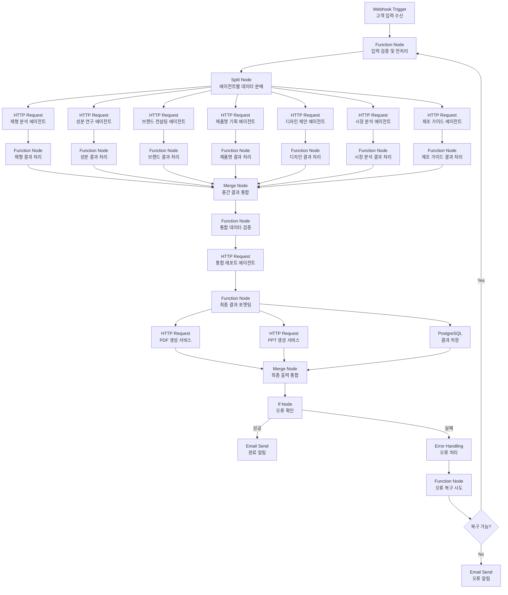

# 화장품 기획 시스템 설계 (확장 버전)

## 1. 시스템 개요

본 시스템은 고객의 입력값(제형, 성분, 컨셉, 패키지 타입)을 기반으로 전문 에이전트 모듈을 통해 화장품 개발 기획을 지원합니다. 각 에이전트는 특정 영역을 담당하며, 최종적으로 통합된 제품 개발 기획 레포트와 제안서를 생성합니다.

### 1.1 시스템 아키텍처 개요


바이브-플레이는 다음과 같은 구성 요소로 이루어진 마이크로서비스 아키텍처를 채택합니다:

1. **프론트엔드 레이어**: Bubble.io 기반 노코드 웹 애플리케이션
2. **API 게이트웨이**: 모든 요청의 중앙 진입점, 인증/인가 처리
3. **워크플로우 오케스트레이터**: n8n 기반 워크플로우 관리 및 실행
4. **에이전트 마이크로서비스**: 독립적으로 실행되는 전문화된 AI 에이전트 모듈
5. **데이터 레이어**: Supabase 및 MongoDB를 활용한 데이터 저장 및 관리
6. **AI 서비스 연동**: OpenAI, Claude, Gemini 등 외부 AI 서비스 연동

### 1.2 주요 기능 요약

- **제품 기획 자동화**: 고객 입력을 바탕으로 AI 기반 제품 기획 자동 생성
- **트렌드 분석**: 화장품 업계 최신 트렌드 데이터 분석 및 적용
- **시각화 도구**: 무드보드 및 제품 목업 자동 생성
- **협업 기능**: 팀 단위 기획 작업 지원 및 의견 공유
- **제조 연계**: 제조사 매칭 및 견적 요청 자동화 (Phase 3)

## 2. 데이터 모델

### 2.1 고객 입력 데이터 모델 (확장)

```json
{
  "project_id": "string",
  "user_id": "string",
  "project_name": "string",
  "input": {
    "formulation": {
      "type": "string",  // 크림, 세럼, 마스크팩 등
      "preferences": ["string"],  // 가벼운 텍스처, 보습력 등
      "texture_keywords": ["string"],  // 부드러운, 빠른 흡수 등
      "main_purpose": ["string"]  // 미백, 주름개선, 진정 등
    },
    "ingredients": {
      "main": ["string"],  // 메인 성분 (예: 히알루론산, 나이아신아마이드)
      "preferences": ["string"],  // 무알콜, 저자극성 등
      "avoid": ["string"],  // 피해야 할 성분
      "source_preference": "string"  // 천연 유래, 합성, 혼합 등
    },
    "concept": {
      "keywords": ["string"],  // 컨셉 키워드 (예: 미니멀, 자연주의, 고급스러움)
      "target_audience": {
        "age_range": "string",
        "gender": "string",
        "skin_type": ["string"],
        "lifestyle": ["string"],
        "concerns": ["string"]
      },
      "mood": "string",  // 전체적인 분위기
      "competitive_positioning": "string",  // 경쟁사 대비 포지셔닝
      "price_range": "string"  // 가격대
    },
    "package": {
      "type": "string",  // 튜브, 펌프, 앰플 등
      "material_preference": ["string"],  // 유리, 재활용 플라스틱 등
      "size_preference": "string",  // 용량
      "aesthetic_keywords": ["string"],  // 디자인 방향성
      "sustainability_level": "string"  // 지속가능성 중요도
    },
    "market_target": {
      "countries": ["string"],  // 목표 시장 국가
      "channels": ["string"],  // 유통 채널 (온라인, 오프라인, 백화점 등)
      "certifications_needed": ["string"]  // 필요 인증 (유기농, 비건 등)
    }
  },
  "references": {
    "inspirational_products": ["string"],  // 영감이 된 제품 이름
    "trend_pins": ["pin_id"],  // 사용자가 핀한 트렌드 ID
    "attached_files": ["file_id"]  // 참고 파일 ID
  },
  "created_at": "timestamp",
  "updated_at": "timestamp",
  "version": "string"
}
```

### 2.2 에이전트 출력 데이터 모델 (확장)

```json
{
  "project_id": "string",
  "formulation_analysis": {
    "trend_analysis": "string",
    "recommended_formulations": [
      {
        "type": "string",
        "description": "string",
        "benefits": ["string"],
        "trend_relevance": "string",
        "texture_profile": "string",
        "stability_considerations": "string",
        "manufacturing_complexity": "number",
        "sensory_characteristics": "string"
      }
    ],
    "technical_considerations": "string",
    "comparative_analysis": [
      {
        "competitor_product": "string",
        "formulation_type": "string",
        "differentiating_factors": ["string"]
      }
    ],
    "innovation_potential": "string"
  },
  "ingredient_analysis": {
    "main_ingredients": [
      {
        "name": "string",
        "benefits": ["string"],
        "research_summary": "string",
        "concentration_range": "string",
        "sourcing_options": ["string"],
        "safety_profile": "string",
        "regulatory_status": "string",
        "cost_factor": "number"
      }
    ],
    "supporting_ingredients": [
      {
        "name": "string",
        "purpose": "string",
        "synergy": "string",
        "recommended_concentration": "string"
      }
    ],
    "trend_alignment": "string",
    "sustainability_analysis": "string",
    "allergen_considerations": "string",
    "clean_beauty_compliance": "string"
  },
  "brand_consulting": {
    "brand_names": ["string"],
    "slogans": ["string"],
    "brand_story": "string",
    "brand_values": ["string"],
    "tone_of_voice": "string",
    "brand_personality": "string",
    "customer_personas": [
      {
        "name": "string",
        "demographic": "string",
        "psychographic": "string",
        "pain_points": ["string"],
        "aspirations": ["string"]
      }
    ],
    "competitive_landscape": [
      {
        "competitor": "string",
        "positioning": "string",
        "strengths": ["string"],
        "weaknesses": ["string"]
      }
    ]
  },
  "product_naming": {
    "name_options": ["string"],
    "name_rationale": ["string"],
    "linguistic_analysis": [
      {
        "name": "string",
        "pronunciation": "string",
        "cross_cultural_considerations": "string",
        "trademark_availability": "boolean"
      }
    ],
    "naming_strategy": "string"
  },
  "design_proposal": {
    "mood_board": {
      "color_palette": [
        {
          "hex_code": "string",
          "name": "string",
          "usage": "string"
        }
      ],
      "texture_keywords": ["string"],
      "visual_references": ["string"],
      "imagery_style": "string",
      "typography_recommendations": {
        "primary_font": "string",
        "secondary_font": "string",
        "text_treatment": "string"
      }
    },
    "package_design": {
      "concept_description": "string",
      "key_visual_elements": ["string"],
      "material_recommendations": ["string"],
      "functional_considerations": "string",
      "sustainability_features": ["string"],
      "manufacturing_considerations": "string",
      "decoration_techniques": ["string"]
    },
    "mockup_variations": [
      {
        "version": "string",
        "description": "string",
        "image_url": "string"
      }
    ]
  },
  "market_analysis": {
    "market_size": "string",
    "growth_rate": "string",
    "target_demographics_data": "string",
    "pricing_analysis": {
      "price_range": "string",
      "price_justification": "string",
      "price_comparison": "string"
    },
    "channel_strategy": {
      "recommended_channels": ["string"],
      "channel_rationale": ["string"]
    },
    "regional_considerations": [
      {
        "region": "string",
        "specific_requirements": ["string"],
        "market_receptiveness": "string"
      }
    ],
    "regulatory_concerns": ["string"]
  },
  "manufacturing_guidance": {
    "production_complexity": "string",
    "estimated_timeline": "string",
    "minimum_order_quantity": "string",
    "recommended_manufacturers": ["string"],
    "quality_control_checkpoints": ["string"],
    "cost_estimation": {
      "raw_materials": "number",
      "packaging": "number",
      "manufacturing": "number",
      "estimated_unit_cost": "number"
    }
  },
  "final_report": {
    "executive_summary": "string",
    "market_potential": "string",
    "development_timeline": "string",
    "cost_considerations": "string",
    "implementation_roadmap": "string",
    "risk_analysis": "string",
    "success_metrics": ["string"]
  }
}
```

## 3. 에이전트 모듈 구조 (확장)

### 3.1 제형 분석 에이전트

- **입력**: 고객 선택 제형, 선호 특성
- **처리**:
  - 최신 제형 트렌드 데이터베이스 검색
  - 유사 제형 사례 분석
  - 기술적 구현 가능성 평가
  - 경쟁사 제품 제형 벤치마킹
  - 제형 안정성 및 호환성 분석
- **출력**: 트렌드 분석 보고서, 추천 제형 옵션, 기술적 고려사항
- **기술 구현**:
  - GPT-4를 활용한 제형 분석 엔진
  - 제형 데이터베이스 연동 (MongoDB)
  - 제형-성분 호환성 매트릭스 참조

### 3.2 성분 연구 에이전트

- **입력**: 주요 성분, 선호 특성
- **처리**:
  - 성분 효능 데이터베이스 검색
  - 최신 연구 자료 분석
  - 주성분과 시너지 효과 있는 보조 성분 검토
  - 성분 안전성 및 규제 상태 확인
  - 지속가능성 및 소싱 옵션 검토
- **출력**: 성분 분석 보고서, 최적 성분 조합 제안, 규제 고려사항
- **기술 구현**:
  - 성분 데이터베이스 API 연동 (CosIng, EWG 등)
  - 벡터 임베딩 기반 성분 유사성 검색
  - 규제 데이터베이스 자동 업데이트

### 3.3 브랜드 컨설팅 에이전트

- **입력**: 컨셉 키워드, 타겟 고객층
- **처리**:
  - 브랜드 아이덴티티 요소 생성
  - 경쟁사 차별화 포인트 도출
  - 브랜드 스토리텔링 구성
  - 타겟 고객 페르소나 구체화
  - 브랜드 커뮤니케이션 전략 제안
- **출력**: 브랜드 네임, 슬로건, 브랜드 캔버스, 고객 페르소나
- **기술 구현**:
  - Claude 모델 기반 브랜드 아이덴티티 생성
  - 감성 분석 알고리즘
  - 시장 포지셔닝 맵 생성 도구

### 3.4 제품명 기획 에이전트

- **입력**: 컨셉, 제형, 성분 정보
- **처리**:
  - 언어적 분석
  - 상표권 검색 자동화
  - 발음 및 기억성 평가
  - 다국어 호환성 검토
  - 네이밍 트렌드 분석
- **출력**: 제품명 옵션 및 근거, 언어적 분석 보고서
- **기술 구현**:
  - 다국어 NLP 모델
  - 상표권 데이터베이스 API 연동
  - 음성학적 분석 도구

### 3.5 디자인 제안 에이전트

- **입력**: 패키지 타입, 브랜드 컨셉, 타겟 고객층
- **처리**:
  - 디자인 트렌드 분석
  - 컨셉에 맞는 색상, 형태 도출
  - 패키지 디자인 시각화
  - 사용성 및 기능성 고려
  - 지속가능성 요소 통합
- **출력**: 디자인 무드보드, 패키지 디자인 제안서, 3D 렌더링
- **기술 구현**:
  - DALL-E/Midjourney API 연동
  - 3D 렌더링 엔진
  - 디자인 트렌드 데이터베이스

### 3.6 시장 분석 에이전트 (신규)

- **입력**: 타겟 고객층, 제품 컨셉, 시장 타겟
- **처리**:
  - 시장 규모 및 성장률 분석
  - 경쟁사 맵핑 및 분석
  - 가격 전략 도출
  - 유통 채널 추천
  - 규제 환경 검토
- **출력**: 시장 분석 보고서, 가격 전략, 유통 계획
- **기술 구현**:
  - 시장 데이터 API 연동 (Statista, Euromonitor 등)
  - 가격 최적화 알고리즘
  - 지역별 규제 데이터베이스

### 3.7 제조 가이드 에이전트 (신규)

- **입력**: 제형, 성분, 패키지 정보
- **처리**:
  - 제조 복잡성 평가
  - 최소 발주량 추정
  - 제조사 매칭
  - 제조 일정 및 비용 예측
  - 품질 관리 체크포인트 설정
- **출력**: 제조 가이드, 비용 예상, 일정 계획
- **기술 구현**:
  - 제조사 데이터베이스
  - 비용 계산 알고리즘
  - 스케줄링 엔진

### 3.8 통합 레포트 에이전트

- **입력**: 모든 에이전트의 결과물
- **처리**:
  - 데이터 통합 및 일관성 확인
  - 시장성 분석 추가
  - 개발 타임라인 및 비용 추정
  - 리스크 분석 및 완화 전략
  - 성공 지표 설정
- **출력**: 최종 제품 개발 기획 레포트, 프레젠테이션 덱, 이그젝티브 요약
- **기술 구현**:
  - 레포트 템플릿 엔진
  - 문서 생성 자동화
  - 시각화 도구 통합

## 4. n8n 워크플로우 설계 (확장)

### 4.1 워크플로우 개요

n8n 워크플로우는 다음 주요 단계로 구성됩니다:

1. 고객 입력 수집 및 검증
2. 에이전트 병렬 실행 및 데이터 처리
3. 중간 결과 통합 및 검증
4. 최종 보고서 생성
5. 결과물 저장 및 알림

### 4.2 워크플로우 상세 구조 (확장)



### 4.3 n8n 노드 상세 설명 (확장)

#### 1. Webhook 트리거 노드
- **기능**: 고객 입력을 API 엔드포인트로 수신
- **설정**:
  - 엔드포인트: `/api/projects/create`
  - 인증 방식: Bearer Token
  - 메서드: POST
  - 응답 타임아웃: 120초

#### 2. 입력 검증 함수 노드
- **기능**: 입력 데이터 유효성 검증 및 전처리
- **주요 검증 항목**:
  - 필수 필드 존재 여부
  - 데이터 형식 적합성
  - 제한된 값 범위 준수 여부
  - 보안 위험 요소 스캔
- **출력**: 검증된 입력 데이터 또는 오류 메시지

#### 3. 스플릿 노드
- **기능**: 에이전트별로 필요한 데이터 분배
- **설정**: 
  - 모드: 병렬 처리
  - 타임아웃: 각 브랜치별 300초

#### 4. HTTP 요청 노드 (각 에이전트별)
- **기능**: 개별 에이전트 API 호출
- **공통 설정**:
  - 메서드: POST
  - 인증: API 키
  - 재시도: 3회
  - 타임아웃: 180초
- **에이전트별 엔드포인트**:
  - 제형 분석: `/api/agents/formulation`
  - 성분 연구: `/api/agents/ingredients`
  - 브랜드 컨설팅: `/api/agents/brand`
  - 제품명 기획: `/api/agents/naming`
  - 디자인 제안: `/api/agents/design`
  - 시장 분석: `/api/agents/market`
  - 제조 가이드: `/api/agents/manufacturing`

#### 5. 결과 처리 함수 노드 (각 에이전트별)
- **기능**: 각 에이전트 응답 처리 및 표준화
- **처리 내용**:
  - 응답 유효성 검증
  - 데이터 구조 표준화
  - 오류 처리 및 대체 로직
  - 결과 메타데이터 추가

#### 6. 결과 병합 노드
- **기능**: 모든 에이전트의 결과를 통합
- **설정**:
  - 병합 모드: JSON 병합
  - 대기 시간: 모든 브랜치 완료 대기

#### 7. 통합 데이터 검증 함수 노드
- **기능**: 통합된 데이터 검증 및 충돌/불일치 해결
- **검증 항목**:
  - 에이전트 간 데이터 일관성
  - 누락된 결과 확인
  - 충돌 해결 (예: 브랜딩과 네이밍 불일치)
- **출력**: 검증된 통합 데이터

#### 8. 통합 레포트 에이전트 HTTP 요청 노드
- **기능**: 최종 보고서 생성 에이전트 호출
- **설정**:
  - 엔드포인트: `/api/agents/final-report`
  - 메서드: POST
  - 타임아웃: 300초

#### 9. 최종 결과 포맷팅 함수 노드
- **기능**: 최종 결과물 형식 변환 및 구조화
- **처리 내용**:
  - JSON 데이터 정리 및 구조화
  - 보고서 형식 적용
  - 다운로드 링크 생성 준비

#### 10. 문서 생성 HTTP 요청 노드 (PDF/PPT)
- **기능**: 외부 서비스를 통해 보고서 문서 생성
- **설정**:
  - PDF 엔드포인트: `/api/documents/pdf`
  - PPT 엔드포인트: `/api/documents/presentation`
  - 메서드: POST
  - 타임아웃: 180초

#### 11. PostgreSQL 노드
- **기능**: 프로젝트 결과 데이터베이스 저장
- **설정**:
  - 작업: Insert
  - 테이블: `project_reports`
  - 컬럼 매핑: 자동 생성

#### 12. 출력 병합 노드
- **기능**: 최종 출력(문서 링크, DB 저장 결과) 통합
- **설정**:
  - 병합 모드: 객체 병합

#### 13. 오류 확인 조건 노드
- **기능**: 워크플로우 실행 결과 확인 및 분기
- **조건**:
  - 모든 출력이 성공적인 경우: 알림 전송
  - 오류가 있는 경우: 오류 처리 진행

#### 14. 알림 이메일 노드
- **기능**: 프로세스 완료 또는 오류 알림 전송
- **설정**:
  - 서비스: SendGrid
  - 템플릿: 상황별 이메일 템플릿
  - 동적 내용: 프로젝트 정보, 결과 링크

#### 15. 오류 처리 노드
- **기능**: 워크플로우 오류 처리 및 복구 시도
- **처리 내용**:
  - 오류 로깅
  - 복구 가능 여부 판단
  - 재실행 파라미터 설정

## 5. API 명세 (확장)

### 5.1 프로젝트 API

#### 프로젝트 생성 API
```http
POST /api/projects
Content-Type: application/json
Authorization: Bearer {token}

Request:
{
  "user_id": "string",
  "project_name": "string",
  "input": {
    // 2.1에 정의된 확장 입력 모델
  }
}

Response:
{
  "project_id": "string",
  "status": "created",
  "estimated_completion_time": "timestamp",
  "workflow_id": "string"
}
```

#### 프로젝트 목록 조회 API
```http
GET /api/projects
Authorization: Bearer {token}
Query Parameters:
  - user_id: string
  - status: string (optional)
  - page: number (optional)
  - limit: number (optional)

Response:
{
  "total": "number",
  "page": "number",
  "limit": "number",
  "projects": [
    {
      "project_id": "string",
      "project_name": "string",
      "status": "string",
      "created_at": "timestamp",
      "updated_at": "timestamp",
      "thumbnail_url": "string"
    }
  ]
}
```

#### 프로젝트 상세 조회 API
```http
GET /api/projects/{project_id}
Authorization: Bearer {token}

Response:
{
  "project_id": "string",
  "project_name": "string",
  "user_id": "string",
  "status": "string",
  "input": { ... },  // 전체 입력 데이터
  "results": { ... },  // 에이전트 결과 데이터 (있는 경우)
  "created_at": "timestamp",
  "updated_at": "timestamp",
  "report_url": "string",  // 최종 보고서 URL (완료된 경우)
  "presentation_url": "string",  // 프레젠테이션 URL (완료된 경우)
  "assets": [
    {
      "type": "string",  // moodboard, mockup 등
      "url": "string",
      "created_at": "timestamp"
    }
  ]
}
```

#### 프로젝트 수정 API
```http
PUT /api/projects/{project_id}
Content-Type: application/json
Authorization: Bearer {token}

Request:
{
  "project_name": "string",
  "input": { ... }  // 수정할 입력 데이터
}

Response:
{
  "project_id": "string",
  "status": "updated",
  "updated_at": "timestamp"
}
```

#### 프로젝트 삭제 API
```http
DELETE /api/projects/{project_id}
Authorization: Bearer {token}

Response:
{
  "project_id": "string",
  "status": "deleted"
}
```

### 5.2 에이전트 API (공통 인터페이스)

#### 에이전트 처리 요청 API
```http
POST /api/agents/{agent_type}
Content-Type: application/json
Authorization: Bearer {token}

Request:
{
  "project_id": "string",
  "input_data": { ... }  // 에이전트 유형에 맞는 입력 데이터
}

Response:
{
  "agent_result_id": "string",
  "status": "processing|completed|failed",
  "estimated_completion_time": "timestamp"
}
```

#### 에이전트 결과 조회 API
```http
GET /api/agents/{agent_type}/results/{agent_result_id}
Authorization: Bearer {token}

Response:
{
  "agent_result_id": "string",
  "project_id": "string",
  "status": "processing|completed|failed",
  "result_data": { ... },  // 에이전트 유형에 맞는 결과 데이터
  "created_at": "timestamp",
  "completed_at": "timestamp"
}
```

#### 에이전트 처리 취소 API
```http
DELETE /api/agents/{agent_type}/results/{agent_result_id}
Authorization: Bearer {token}

Response:
{
  "agent_result_id": "string",
  "status": "cancelled"
}
```

### 5.3 워크플로우 관리 API

#### 워크플로우 상태 확인 API
```http
GET /api/workflows/{workflow_id}
Authorization: Bearer {token}

Response:
{
  "workflow_id": "string",
  "project_id": "string",
  "status": "queued|in_progress|completed|failed",
  "progress": {
    "total_steps": "number",
    "completed_steps": "number",
    "current_step": "string"
  },
  "agent_statuses": [
    {
      "agent_type": "string",
      "status": "pending|in_progress|completed|failed",
      "start_time": "timestamp",
      "end_time": "timestamp"
    }
  ],
  "estimated_completion_time": "timestamp",
  "created_at": "timestamp",
  "updated_at": "timestamp"
}
```

#### 워크플로우 취소 API
```http
POST /api/workflows/{workflow_id}/cancel
Authorization: Bearer {token}

Response:
{
  "workflow_id": "string",
  "status": "cancelling|cancelled",
  "updated_at": "timestamp"
}
```

## 6. 데이터베이스 스키마 (신규)

### 6.1 PostgreSQL 스키마

#### users 테이블
```sql
CREATE TABLE users (
  id UUID PRIMARY KEY,
  email VARCHAR(255) UNIQUE NOT NULL,
  full_name VARCHAR(255),
  company_name VARCHAR(255),
  role VARCHAR(100),
  created_at TIMESTAMP WITH TIME ZONE DEFAULT NOW(),
  updated_at TIMESTAMP WITH TIME ZONE DEFAULT NOW(),
  last_login TIMESTAMP WITH TIME ZONE,
  subscription_tier VARCHAR(50),
  is_active BOOLEAN DEFAULT TRUE
);
```

#### projects 테이블
```sql
CREATE TABLE projects (
  id UUID PRIMARY KEY,
  user_id UUID REFERENCES users(id) ON DELETE CASCADE,
  name VARCHAR(255) NOT NULL,
  description TEXT,
  status VARCHAR(50) NOT NULL,
  created_at TIMESTAMP WITH TIME ZONE DEFAULT NOW(),
  updated_at TIMESTAMP WITH TIME ZONE DEFAULT NOW(),
  version INT DEFAULT 1,
  input_data JSONB,
  is_archived BOOLEAN DEFAULT FALSE
);
```

#### agent_results 테이블
```sql
CREATE TABLE agent_results (
  id UUID PRIMARY KEY,
  project_id UUID REFERENCES projects(id) ON DELETE CASCADE,
  agent_type VARCHAR(100) NOT NULL,
  status VARCHAR(50) NOT NULL,
  result_data JSONB,
  created_at TIMESTAMP WITH TIME ZONE DEFAULT NOW(),
  completed_at TIMESTAMP WITH TIME ZONE,
  version INT DEFAULT 1
);
```

#### trend_cards 테이블
```sql
CREATE TABLE trend_cards (
  id UUID PRIMARY KEY,
  title VARCHAR(255) NOT NULL,
  description TEXT,
  category VARCHAR(100) NOT NULL,
  tags TEXT[],
  image_url VARCHAR(255),
  source VARCHAR(255),
  created_at TIMESTAMP WITH TIME ZONE DEFAULT NOW(),
  updated_at TIMESTAMP WITH TIME ZONE DEFAULT NOW(),
  is_active BOOLEAN DEFAULT TRUE
);
```

#### user_pins 테이블
```sql
CREATE TABLE user_pins (
  id UUID PRIMARY KEY,
  user_id UUID REFERENCES users(id) ON DELETE CASCADE,
  trend_card_id UUID REFERENCES trend_cards(id) ON DELETE CASCADE,
  notes TEXT,
  created_at TIMESTAMP WITH TIME ZONE DEFAULT NOW(),
  project_id UUID REFERENCES projects(id) ON DELETE SET NULL
);
```

#### ingredients 테이블
```sql
CREATE TABLE ingredients (
  id UUID PRIMARY KEY,
  name VARCHAR(255) NOT NULL,
  inci_name VARCHAR(255) UNIQUE NOT NULL,
  functions TEXT[],
  ewg_rating VARCHAR(10),
  description TEXT,
  source_type VARCHAR(50),
  sustainability_score INT,
  created_at TIMESTAMP WITH TIME ZONE DEFAULT NOW(),
  updated_at TIMESTAMP WITH TIME ZONE DEFAULT NOW()
);
```

#### packaging_types 테이블
```sql
CREATE TABLE packaging_types (
  id UUID PRIMARY KEY,
  name VARCHAR(255) NOT NULL,
  category VARCHAR(100) NOT NULL,
  material VARCHAR(100),
  description TEXT,
  image_url VARCHAR(255),
  sustainability_score INT,
  created_at TIMESTAMP WITH TIME ZONE DEFAULT NOW(),
  updated_at TIMESTAMP WITH TIME ZONE DEFAULT NOW()
);
```

#### project_assets 테이블
```sql
CREATE TABLE project_assets (
  id UUID PRIMARY KEY,
  project_id UUID REFERENCES projects(id) ON DELETE CASCADE,
  asset_type VARCHAR(100) NOT NULL,
  url VARCHAR(255) NOT NULL,
  metadata JSONB,
  created_at TIMESTAMP WITH TIME ZONE DEFAULT NOW(),
  updated_at TIMESTAMP WITH TIME ZONE DEFAULT NOW()
);
```

### 6.2 MongoDB 스키마 (비정형 데이터용)

#### trend_analytics 컬렉션
```javascript
{
  _id: ObjectId,
  category: String,  // "ingredient", "formulation", "packaging", "concept"
  keyword: String,
  trend_score: Number,
  trend_period: String,  // "rising", "stable", "declining"
  data_points: [
    {
      source: String,
      timestamp: Date,
      value: Number,
      region: String
    }
  ],
  analysis: String,
  created_at: Date,
  updated_at: Date
}
```

#### agent_knowledge 컬렉션
```javascript
{
  _id: ObjectId,
  agent_type: String,
  knowledge_area: String,
  content: String,
  reference_urls: [String],
  last_updated: Date,
  confidence_score: Number,
  vector_embedding: Binary  // 임베딩 벡터 (검색용)
}
```

## 7. 확장 기술 구성요소 (신규)

### 7.1 AI 모델 선택 및 튜닝

#### LLM 모델 선택 기준
- **GPT-4**: 복잡한 컨텍스트 이해와 창의적 생성이 필요한 브랜드 컨설팅, 제품명 기획 에이전트
- **Claude 3 Opus**: 상세하고 전문적인 분석이 필요한 성분 연구, 제형 분석 에이전트
- **Gemini Pro**: 다국어 지원 및 다양한 문화적 컨텍스트가 필요한 시장 분석 에이전트
- **LLaMa 3**: 비용 효율적인 기본 데이터 처리 및 분류 작업

#### 프롬프트 엔지니어링 전략
- 에이전트별 특화된 프롬프트 템플릿 설계
- Chain-of-Thought 프롬프트 구조 활용
- 맥락 정보 제공을 위한 Few-shot 학습 예제 포함
- 제약 조건 및 가이드라인 명시적 정의

#### 모델 튜닝 접근법
- 각 에이전트 영역별 도메인 특화 미세 튜닝 (Fine-tuning)
- 화장품 산업 데이터로 RAG (Retrieval-Augmented Generation) 구현
- 성능 지표 모니터링 및 지속적 개선

### 7.2 벡터 데이터베이스 통합

#### Pinecone 벡터 DB 활용
- 성분, 트렌드, 디자인 요소의 벡터 임베딩 저장
- 의미 기반 유사성 검색 구현
- 실시간 트렌드 분석을 위한 벡터 클러스터링

#### 주요 벡터 인덱스
1. **성분 인덱스**: 성분의 기능, 효과, 특성 기반 벡터화
2. **트렌드 인덱스**: 트렌드 키워드 및 설명 텍스트 벡터화
3. **디자인 인덱스**: 시각적 요소 및 스타일 벡터화

### 7.3 실시간 데이터 파이프라인

#### 데이터 소스 연동
- 소셜 미디어 API (Instagram, TikTok, Pinterest)
- 화장품 업계 뉴스 및 블로그 RSS 피드
- 전문 시장 보고서 API (Mintel, Euromonitor)

#### ETL 파이프라인 (Apache Airflow)
- 일일/주간 데이터 수집 스케줄링
- 데이터 정제 및 구조화
- 트렌드 점수 계산 및 업데이트
- 벡터 임베딩 생성 및 저장

### 7.4 강화된 보안 아키텍처

#### 데이터 보안
- 저장 및 전송 중 데이터 암호화 (AES-256)
- 민감 정보 마스킹 및 익명화
- 정기적인 데이터 백업 및 재해 복구 계획

#### 접근 제어
- RBAC (Role-Based Access Control) 구현
- JWT 기반 세션 관리
- IP 화이트리스트 및 비정상 접근 탐지
- 다단계 인증 (MFA) 지원

#### 보안 모니터링
- 실시간 로그 분석 및 알림
- 취약점 스캐닝 자동화
- 정기적인 보안 감사 및 침투 테스트

## 8. 시스템 확장성 및 성능 최적화 (신규)

### 8.1 서버리스 아키텍처 활용

#### AWS Lambda 함수
- 에이전트 처리 로직을 개별 Lambda 함수로 구현
- 이벤트 기반 트리거로 자동 스케일링
- 비용 최적화 (사용한 만큼만 지불)

#### Amazon API Gateway
- API 요청 라우팅 및 관리
- 스로틀링 및 할당량 관리
- API 키 관리 및 사용량 모니터링

### 8.2 캐싱 전략

#### Redis 캐시 레이어
- 자주 사용되는 트렌드 데이터 캐싱
- 세션 데이터 저장
- AI 응답 임시 캐싱 (중복 요청 최적화)

#### 캐싱 정책
- 트렌드 데이터: 24시간 TTL
- 사용자 세션: 1시간 TTL
- AI 응답: 5분 TTL (빠른 재생성 가능)

### 8.3 비동기 처리 및 대기열

#### RabbitMQ 메시지 큐
- 에이전트 작업 요청 대기열화
- 부하 분산 및 처리 속도 최적화
- 실패 작업 재시도 및 데드레터 큐 관리

#### 대기열 구조
- 우선순위 대기열: 긴급 요청 처리
- 표준 대기열: 일반 요청 처리
- 지연 대기열: 예약된 작업 처리

### 8.4 컨테이너화 및 오케스트레이션

#### Docker 컨테이너
- 에이전트별 독립 컨테이너
- 표준화된 환경 및 의존성 관리
- 빠른 배포 및 롤백

#### Kubernetes 클러스터
- 자동 스케일링 및 부하 분산
- 자가 복구 기능
- 블루-그린 배포 전략

## 9. 구현 로드맵 (확장)

### 9.1 Phase 1: MVP (2개월)
- **주요 목표**: 핵심 기능을 갖춘 기본 시스템 구축
- **핵심 개발 항목**:
  - 기본 데이터 모델 및 스키마 구현
  - 3개 핵심 에이전트 개발 (제형, 성분, 브랜드)
  - 간소화된 n8n 워크플로우 구성
  - Bubble.io 기본 인터페이스 구현
  - Supabase 연동 및 사용자 인증
- **마일스톤**:
  - 2주: 데이터 모델 및 API 설계 완료
  - 4주: 핵심 에이전트 프로토타입 개발
  - 6주: Bubble.io 기본 UI 구현
  - 8주: MVP 통합 테스트 및 배포

### 9.2 Phase 2: 기능 확장 (3개월)
- **주요 목표**: 사용자 경험 향상 및 기능 확장
- **핵심 개발 항목**:
  - 모든 에이전트 모듈 완성 (디자인, 제품명, 시장 분석)
  - 무드보드 및 목업 생성 기능 구현
  - 트렌드 핀 시스템 고도화
  - AI 추천 알고리즘 개선
  - 기초 분석 대시보드 구현
- **마일스톤**:
  - 1개월: 추가 에이전트 모듈 개발
  - 2개월: 시각화 도구 (무드보드, 목업) 구현
  - 3개월: 트렌드 핀 시스템 및 UI/UX 개선

### 9.3 Phase 3: 엔터프라이즈 기능 (3개월)
- **주요 목표**: 엔터프라이즈 기능 및 통합 확장
- **핵심 개발 항목**:
  - 제조사 연계 시스템 개발
  - 견적 및 발주 프로세스 자동화
  - 고급 데이터 분석 및 인사이트 도구
  - 다국어 지원 및 지역별 최적화
  - API 통합 확장 및 SDK 개발
- **마일스톤**:
  - 1개월: 제조사 연계 시스템 설계 및 API 개발
  - 2개월: 발주 프로세스 및 견적 시스템 구현
  - 3개월: 분석 도구 및 다국어 지원 완료

### 9.4 Phase 4: 확장 및 고도화 (6개월)
- **주요 목표**: 플랫폼 확장 및 AI 고도화
- **핵심 개발 항목**:
  - 맞춤형 AI 모델 학습 및 최적화
  - 엔터프라이즈 통합 확장 (ERP, PLM 등)
  - 고급 협업 도구 개발
  - 마켓플레이스 기능 추가
  - 모바일 앱 개발
- **마일스톤**:
  - 2개월: 맞춤형 AI 모델 학습 및 배포
  - 4개월: 엔터프라이즈 통합 및 협업 도구
  - 6개월: 마켓플레이스 및 모바일 앱 출시

## 10. 성능 지표 및 모니터링 (신규)

### 10.1 핵심 성능 지표 (KPI)

#### 시스템 성능 지표
- **응답 시간**: 에이전트 요청 평균 응답 시간 (목표: <5초)
- **처리량**: 시간당 처리 가능 프로젝트 수 (목표: >100)
- **가용성**: 시스템 업타임 (목표: 99.9%)
- **오류율**: 요청 대비 실패율 (목표: <0.5%)

#### 사용자 경험 지표
- **사용자 만족도**: NPS 점수 (목표: >8/10)
- **완료율**: 시작한 프로젝트 중 완료 비율 (목표: >70%)
- **재사용률**: 1개월 내 재방문 비율 (목표: >50%)
- **평균 세션 시간**: 사용자당 평균 사용 시간 (목표: >15분)

### 10.2 모니터링 시스템

#### 인프라 모니터링 (Prometheus + Grafana)
- 서버 리소스 사용량 (CPU, 메모리, 디스크)
- 네트워크 트래픽 및 지연 시간
- 데이터베이스 성능 및 쿼리 지연 시간
- API 엔드포인트 응답 시간

#### 애플리케이션 모니터링 (Sentry)
- 오류 및 예외 추적
- 성능 병목 현상 식별
- 사용자 세션 추적
- 크래시 리포트 및 분석

#### 비즈니스 분석 (Amplitude)
- 사용자 행동 흐름 분석
- 기능별 사용 통계
- 전환율 및 이탈률 추적
- A/B 테스트 결과 분석

## 11. 규제 준수 및 데이터 거버넌스 (신규)

### 11.1 개인정보 보호

#### GDPR 준수 방안
- 데이터 수집 최소화 원칙 적용
- 명시적 동의 프로세스 구현
- 데이터 액세스 및 삭제 요청 처리 자동화
- 데이터 침해 감지 및 대응 프로토콜

#### 개인정보 보호 기술적 조치
- 개인 식별 정보(PII) 암호화 저장
- 익명화 및 가명화 처리
- 접근 로그 기록 및 감사
- 주기적인 데이터 삭제 정책

### 11.2 화장품 관련 규제 준수

#### 국가별 규제 데이터베이스
- EU 화장품 규정 (EC No 1223/2009)
- 미국 FDA 화장품 규정
- 중국 NMPA 규정
- 한국 식약처 규정

#### 규제 준수 검증 시스템
- 금지 성분 자동 체크
- 국가별 표시 요구사항 안내
- 제품 안전성 평가 가이드라인
- 문서화 요구사항 템플릿

## 12. 향후 연구 개발 방향 (신규)

### 12.1 AI 모델 발전 계획

#### 도메인 특화 모델 개발
- 화장품 성분 이해를 위한 특화 모델
- 디자인 트렌드 예측 모델
- 소비자 선호도 예측 모델

#### 멀티모달 AI 통합
- 텍스트-이미지 통합 이해 모델
- 시각적 트렌드 자동 분석
- 3D 렌더링 품질 개선

### 12.2 사용자 경험 혁신

#### 증강현실 통합
- AR 기반 제품 가상 체험
- 실시간 패키지 시뮬레이션
- 매장 진열 시각화

#### 음성 인터페이스
- 음성 명령을 통한 프로젝트 관리
- 음성 기반 AI 컨설팅
- 회의 중 실시간 아이디어 기록

### 12.3 시스템 자율성 향상

#### 자가 학습 시스템
- 사용자 피드백 기반 모델 개선
- 제품 성공 사례 자동 학습
- 트렌드 예측 정확도 자동 향상

#### 자동화된 품질 관리
- AI 생성 결과 품질 자동 평가
- 비일관성 및 오류 자동 감지
- 지속적인 모델 성능 모니터링