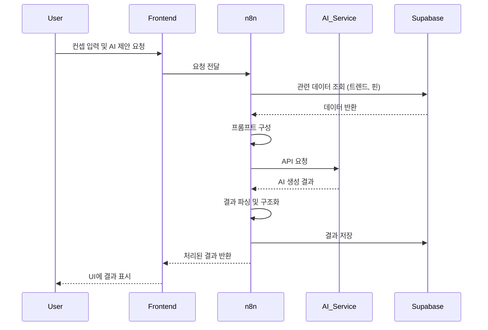
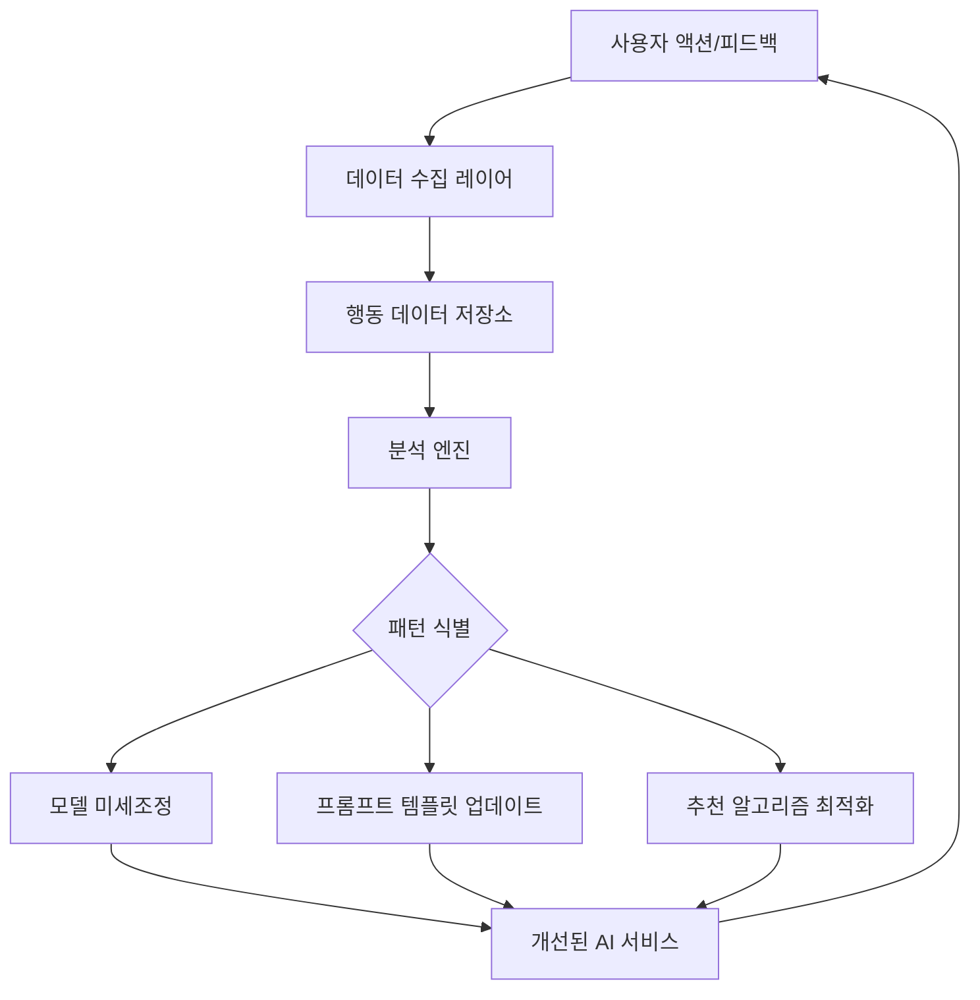

# 바이브-플레이(Vibe-Play) AI 통합 명세서

## 1. AI 통합 개요

바이브-플레이 플랫폼은 다양한 AI 모델을 활용하여 화장품 개발 과정의 여러 단계를 지원합니다. 이 문서는 각 AI 모듈의 목적, 사용 사례, 데이터 흐름 및 구현 방법을 상세히 설명합니다.

## 2. 주요 AI 모듈

### 2.1. 제품 컨셉 생성기

**목적**: 사용자 입력과 트렌드 데이터를 기반으로 혁신적인 화장품 제품 컨셉을 생성

**사용 AI 모델**: OpenAI GPT-4 또는 Anthropic Claude

**입력 데이터**:
- 사용자가 입력한 기본 아이디어/키워드
- 선택된 트렌드핀 정보
- 타겟 고객 정보
- 제품 카테고리 정보

**출력 데이터**:
- 제품명 후보 (3-5개)
- 컨셉 요약 (50-100단어)
- 주요 마케팅 포인트 (3-5개 bullet points)
- USP(Unique Selling Proposition)

**프롬프트 전략**:
```
역할: 당신은 혁신적인 화장품 제품 컨셉과 마케팅 전략을 개발하는 전문가입니다.

입력 정보:
- 기본 아이디어: {user_input}
- 제품 카테고리: {product_category}
- 타겟 고객: {target_audience}
- 참고 트렌드: {trend_pins}

다음 형식으로 응답해주세요:

제품명 후보:
1. [제품명 1]
2. [제품명 2]
3. [제품명 3]
4. [제품명 4]
5. [제품명 5]

컨셉 요약:
[50-100단어 분량의 컨셉 설명]

주요 마케팅 포인트:
• [마케팅 포인트 1]
• [마케팅 포인트 2]
• [마케팅 포인트 3]
• [마케팅 포인트 4]
• [마케팅 포인트 5]

USP(핵심 차별화 요소):
[제품의 가장 강력한 차별화 포인트]
```

**구현 방식**:
- n8n을 통해 OpenAI API 연동
- 사용자 입력과 핀 데이터를 조합하여 프롬프트 생성
- 응답 파싱하여 구조화된 형태로 저장 및 표시
- 결과 캐싱하여 API 비용 최적화

### 2.2. 성분 추천 엔진

**목적**: 제품 컨셉에 최적화된 화장품 성분 조합을 추천

**사용 AI 모델**: OpenAI GPT-4 + 자체 개발 호환성 분석 알고리즘

**입력 데이터**:
- 제품 컨셉 및 카테고리
- 타겟 효능/효과
- 선호/제외 성분 리스트 (사용자 입력)
- 성분 데이터베이스 (EWG 등급, 기능, 효과)

**출력 데이터**:
- 핵심 활성 성분 (3-5개)
- 보조 성분 리스트
- 성분별 예상 효과 및 농도 범위
- 성분 조합의 과학적 근거

**프롬프트 전략**:
```
역할: 당신은 화장품 제형 및 성분 전문가로서 효과적이고 안전한 성분 조합을 추천합니다.

입력 정보:
- 제품 컨셉: {concept}
- 제품 카테고리: {category}
- 타겟 효과: {target_effects}
- 선호 성분: {preferred_ingredients}
- 제외 성분: {excluded_ingredients}

고려사항:
- EWG 등급 3 이하의 안전한 성분 중심
- 과학적 효능이 입증된 성분 우선
- 성분 간 호환성 확인
- 트렌드와 혁신성 고려

다음 형식으로 응답해주세요:

핵심 활성 성분:
1. [성분명] - [주요 효능] - [권장 농도 범위] - [EWG 등급]
2. [성분명] - [주요 효능] - [권장 농도 범위] - [EWG 등급]
3. [성분명] - [주요 효능] - [권장 농도 범위] - [EWG 등급]
...

보조 성분:
• [카테고리: 보습제] - [성분명] - [기능] - [권장 농도]
• [카테고리: 유화제] - [성분명] - [기능] - [권장 농도]
• [카테고리: 보존제] - [성분명] - [기능] - [권장 농도]
...

성분 시너지 효과:
[성분 조합의 시너지 효과 설명]

과학적 근거:
[추천 성분의 과학적 근거 및 참고 자료]
```

**구현 방식**:
- Supabase에서 성분 데이터베이스 호스팅
- 사전 필터링: 사용자 조건에 맞는 성분 후보군 1차 선별
- AI 프롬프트에 성분 데이터 삽입하여 최적 조합 도출
- 호환성 검사 알고리즘으로 AI 추천 결과 검증
- 결과 캐싱 및 개인화된 추천 학습

### 2.3. 시각적 무드보드 생성기

**목적**: 제품 컨셉을 시각화한 무드보드 자동 생성

**사용 AI 모델**: DALL-E 3 또는 Midjourney (API 통합)

**입력 데이터**:
- 제품 컨셉 및 카테고리
- 컬러 팔레트 또는 선호 색상
- 디자인 스타일 키워드
- 참고 이미지 (선택적)

**출력 데이터**:
- 고해상도 무드보드 이미지
- 사용된 컬러 코드 추출
- 디자인 요소 설명

**프롬프트 전략**:
```
제품 무드보드 이미지를 생성해주세요:

제품 유형: {product_type}
컨셉: {concept_description}
스타일: {style_keywords}
주요 색상: {color_palette}
타겟 고객: {target_audience}

다음 요소를 포함한 무드보드를 만들어주세요:
- 주요 컬러 팔레트를 시각적으로 표현
- 제품과 연관된 추상적 이미지나 텍스처
- 타겟 고객의 라이프스타일을 반영하는 요소
- 컨셉을 표현하는 타이포그래피 힌트
- 전체적으로 조화롭고 세련된 디자인

이미지 스타일: 현대적이고 깔끔한 무드보드, 화장품 브랜딩에 적합한 프로페셔널한 룩
해상도: 1024x1024
```

**구현 방식**:
- n8n을 통해 이미지 생성 API 호출
- 컨셉 정보를 구조화하여 최적화된 프롬프트 자동 생성
- 생성된 이미지를 Supabase Storage에 저장
- 색상 분석 알고리즘으로 주요 컬러 코드 추출

### 2.4. 제품 목업 생성기

**목적**: 실제 제품 외관을 시각화한 3D 목업 이미지 생성

**사용 AI 모델**: Stable Diffusion 또는 전문 3D 렌더링 API

**입력 데이터**:
- 선택된 용기 타입
- 라벨 디자인 요소
- 컬러 팔레트
- 브랜드 요소 (로고 등)

**출력 데이터**:
- 다양한 각도의 제품 목업 이미지 (3-5장)
- 마케팅용 합성 이미지 (선택적)

**프롬프트 전략**:
```
다음 설명에 따라 화장품 제품 목업 이미지를 생성해주세요:

용기 유형: {container_type} (예: 유리 드롭퍼 병, 플라스틱 튜브, 에어리스 펌프 등)
제품 유형: {product_type}
주요 색상: {primary_color}
보조 색상: {secondary_colors}
라벨 스타일: {label_style}
브랜드명: {brand_name}

생성할 이미지:
1. 제품 정면 뷰, 고급스러운 조명, 깔끔한 배경
2. 제품 45도 각도 뷰
3. 제품과 함께 텍스처 또는 사용감을 표현하는 이미지

스타일: 실사적인 3D 렌더링, 프로페셔널한 제품 사진과 같은 품질
해상도: 1024x1024
```

**구현 방식**:
- 패키지 유형 3D 모델 라이브러리 구축
- 라벨 템플릿 시스템 개발
- n8n 워크플로우로 이미지 생성 API 통합
- 이미지 후처리 자동화 (배경 제거, 해상도 최적화)

### 2.5. 트렌드 분석 엔진

**목적**: 최신 화장품/뷰티 트렌드를 분석하고 신규 트렌드 카드 생성

**사용 AI 모델**: Claude 또는 GPT-4 + 자체 개발 트렌드 스코어링 알고리즘

**입력 데이터**:
- 뷰티 산업 뉴스 및 기사
- 소셜 미디어 트렌드 데이터
- 시장 조사 보고서
- 검색 트렌드 데이터

**출력 데이터**:
- 트렌드 카드 (제목, 설명, 카테고리, 태그)
- 트렌드 점수 및 성장률
- 관련 참고 자료

**프롬프트 전략**:
```
역할: 당신은 화장품/뷰티 산업의 최신 트렌드를 분석하고 요약하는 전문가입니다.

다음 데이터를 분석해주세요:
{trend_data}

분석 요청:
1. 이 데이터에서 파악되는 주요 트렌드를 식별해주세요.
2. 각 트렌드의 중요성과 성장 가능성을 평가해주세요.
3. 트렌드가 적용될 수 있는 제품 카테고리를 제안해주세요.

다음 형식으로 각 트렌드에 대한 트렌드 카드를 작성해주세요:

--- 트렌드 카드 ---
제목: [명확하고 간결한 트렌드 이름]
카테고리: [ingredient/packaging/formulation/concept/marketing/design 중 선택]
설명: [100-150단어 분량의 트렌드 설명]
주요 특징:
• [특징 1]
• [특징 2]
• [특징 3]
관련 제품 카테고리: [적용 가능한 제품 유형]
예상 성장률: [high/medium/low]
추천 태그: [관련 키워드 5-7개]
```

**구현 방식**:
- 정기적인 웹 크롤링으로 트렌드 데이터 수집
- n8n 워크플로우로 데이터 전처리 및 AI 분석 자동화
- 트렌드 점수 알고리즘: 언급 빈도, 성장률, 영향력 등 가중치 부여
- 관리자 검토 단계를 거쳐 트렌드 카드 승인 및 게시

## 3. AI 학습 및 개인화 전략

### 3.1. 사용자 피드백 기반 학습

**수집 데이터**:
- AI 제안에 대한 사용자 평가 (별점 또는 좋아요/싫어요)
- 제안 중 선택된 항목 vs. 무시된 항목
- 수정 패턴 (사용자가 어떤 부분을 주로 수정하는지)

**활용 방법**:
- 사용자 선호도 프로필 구축
- 프롬프트 템플릿 최적화
- 성공적인 제안 패턴 식별 및 강화

### 3.2. 컨텐츠 기반 개인화

**구현 방식**:
- 사용자의 핀 및 프로젝트 이력 분석
- 선호하는 성분, 디자인 스타일, 제품 유형 파악
- 트렌드 추천 알고리즘에 개인화 가중치 적용
- 사용자 세그먼트 클러스터링으로 유사 사용자 기반 추천

## 4. AI 모델 성능 및 비용 최적화

### 4.1. 프롬프트 엔지니어링 전략

- **체이닝 기법**: 복잡한 작업을 단계별로 나누어 처리
- **예시 주입**: 고품질 응답 예시를 프롬프트에 포함
- **구조화된 출력 요청**: 파싱하기 쉬운 형식으로 응답 요청
- **컨텍스트 최적화**: 토큰 사용량을 최소화하면서 필요 정보 제공

### 4.2. 캐싱 및 재사용 전략

- **유사 쿼리 클러스터링**: 비슷한 요청에 대한 응답 재활용
- **중간 결과 저장**: 다단계 프로세스의 중간 결과 캐싱
- **사용량이 많은 시간대 예측**: 캐싱 우선순위 동적 조정

### 4.3. 계층형 모델 사용 전략

- **필터링 및 분류**: 작은 모델로 1차 처리
- **창의적 생성**: 고성능 모델(GPT-4/Claude)로 핵심 창의적 작업 수행
- **결과 검증**: 중간 크기 모델로 출력 검증 및 포맷팅

## 5. 데이터 흐름 및 통합

### 5.1. AI 프로세싱 워크플로우



### 5.2. 데이터 피드백 루프



## 6. 보안 및 데이터 프라이버시

### 6.1. AI 모델 사용 보안 고려사항

- **데이터 최소화**: AI에 전송되는 개인 식별 정보 최소화
- **데이터 익명화**: 필요시 개인정보 마스킹 처리
- **암호화**: 전송 중 및 저장 데이터 암호화
- **요청/응답 로깅**: 감사 목적으로 AI 상호작용 기록 (개인정보 제외)

### 6.2. 사용자 데이터 관리

- **명시적 동의**: AI 학습 목적의 데이터 사용에 대한 사용자 동의
- **열람/삭제 권한**: 사용자가 자신의 AI 상호작용 기록 확인 및 삭제 가능
- **데이터 보존 정책**: 미사용 데이터 자동 삭제 일정 수립

## 7. 구현 로드맵

### 7.1. MVP (2개월)
- 기본 제품 컨셉 생성기 구현 (OpenAI GPT-4)
- 핵심 성분 추천 기능 (기본 버전)
- 간단한 트렌드 카드 관리 시스템

### 7.2. Phase 2 (3개월)
- 무드보드 생성기 구현 (DALL-E/Midjourney)
- 성분 추천 엔진 고도화
- 트렌드 분석 엔진 베타 버전
- 개인화 추천 시스템 1차 버전

### 7.3. Phase 3 (3개월)
- 3D 제품 목업 생성기
- AI 기반 마케팅 카피 생성기
- 사용자 피드백 기반 학습 시스템
- 트렌드 예측 모델