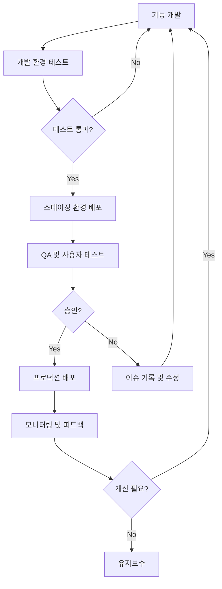

# 바이브-플레이(Vibe-Play) Bubble.io 아키텍처 설계

## 1. Bubble.io 개요

Bubble.io는 노코드 웹 애플리케이션 개발 플랫폼으로, 바이브-플레이의 프론트엔드를 빠르게 구현하기 위한 주요 도구입니다. 이 문서는 Bubble.io에서 바이브-플레이를 설계하는 방법과 Supabase, n8n, 다양한 AI 서비스와의 통합 방안을 설명합니다.

## 2. 애플리케이션 구조

### 2.1. 페이지 구성

| 페이지명 | 설명 | 주요 컴포넌트 |
|---------|------|-------------|
| **홈/랜딩** | 서비스 소개 및 회원가입 유도 | 헤더, 히어로 섹션, 기능 소개, CTA 버튼, 푸터 |
| **온보딩** | 신규 사용자 가이드 | 단계별 튜토리얼, 진행 표시줄, 다음/이전 버튼 |
| **프로젝트 대시보드** | 사용자 프로젝트 목록 | 프로젝트 카드 그리드, 필터, 정렬, '새 프로젝트' 버튼 |
| **Vibe Play** | 제품 기획 워크스페이스 | 입력 패널, AI 제안 영역, 미리보기, 저장 버튼 |
| **트렌드핀 아카이브** | 트렌드 탐색 및 핀 기능 | 검색창, 필터, 카드 그리드, 핀 버튼, 카테고리 네비게이션 |
| **마이페이지** | 사용자 정보 및 핀 관리 | 탭 메뉴, 핀 컬렉션, 계정 정보, 프로젝트 요약 |
| **무드보드 생성기** | 시각적 무드보드 제작 | 스타일 선택기, AI 생성 버튼, 결과 갤러리, 저장 옵션 |
| **제품 목업 생성기** | 제품 외관 시각화 | 용기 선택기, 컬러 피커, 라벨 편집기, 3D 미리보기, 저장 옵션 |

### 2.2. 데이터 타입 (Bubble.io)

| 데이터 타입 | 주요 필드 | 설명 |
|------------|----------|------|
| **User** | email, password, full_name, company_name, profile_image | 사용자 정보 |
| **Project** | name, description, status, created_date, user(관계) | 프로젝트 기본 정보 |
| **ProjectConcept** | project(관계), target_audience, core_concept, product_type, ai_suggestions | 제품 컨셉 정보 |
| **TrendCard** | title, description, category, image, tags | 트렌드 정보 카드 |
| **UserPin** | user(관계), trend_card(관계), notes, pinned_date | 사용자가 핀한 트렌드 |
| **Ingredient** | name, functions, ewg_rating, description | 화장품 성분 정보 |
| **Packaging** | name, type, material, image | 용기 정보 |
| **Moodboard** | project(관계), image, generation_params | 생성된 무드보드 |
| **ProductMockup** | project(관계), image, package_type | 생성된 제품 목업 |

## 3. 주요 워크플로우 구현

### 3.1. 사용자 인증 및 권한

**구현 방식**: Bubble.io 내장 인증 + Supabase Auth 연동

**주요 기능**:
- 이메일/비밀번호 로그인
- 소셜 로그인 (구글, 페이스북 등)
- 권한 레벨 설정 (일반 사용자, 관리자)
- JWT 기반 인증 토큰 관리

**Bubble 워크플로우**:
1. 로그인 폼 → 'Log user in' 액션
2. 성공 시 → Supabase JWT 토큰 저장 (API 호출용)
3. 실패 시 → 에러 메시지 표시

### 3.2. 프로젝트 생성 및 관리

**구현 방식**: Bubble 데이터베이스 + Supabase 동기화

**주요 워크플로우**:
1. '새 프로젝트' 버튼 → 모달 창 표시
2. 기본 정보 입력 → 'Create a new Project' 액션
3. 프로젝트 생성 완료 → Vibe Play 페이지로 리디렉션
4. Supabase 백업 워크플로우 (n8n) → 주기적 동기화

**데이터 흐름**:
```
사용자 입력 → Bubble DB 저장 → n8n 워크플로우 → Supabase 동기화
```

### 3.3. AI 제안 생성 프로세스

**구현 방식**: Bubble + n8n + OpenAI/Claude API

**주요 워크플로우**:
1. 'AI 제안 요청' 버튼 → 입력 데이터 수집
2. API 워크플로우 트리거 → n8n 워크플로우 호출
3. n8n → AI 서비스 API 호출
4. 결과 수신 → 파싱 및 Bubble로 반환
5. UI에 결과 표시 → 사용자 선택/편집 가능

**데이터 흐름**:
```
Bubble 프론트엔드 → n8n 워크플로우 매니저 → OpenAI/Claude API → 결과 처리 → Bubble UI 업데이트
```

**핵심 Bubble 요소**:
- API 워크플로우 엔드포인트 (n8n 호출용)
- 로딩 상태 관리 (API 응답 대기 중 표시)
- 응답 처리 및 시각화 컴포넌트

### 3.4. 트렌드 핀 시스템

**구현 방식**: Bubble + Supabase

**주요 워크플로우**:
1. 트렌드 카드 표시 → Repeating Group 활용
2. '핀하기' 버튼 → 'Create a new UserPin' 액션
3. 핀 해제 → 'Delete a thing' 액션
4. 마이핀으로 이동 → 핀 필터링 및 정렬

**인터랙션 설계**:
- 카드 호버 → 핀 버튼 표시
- 핀 상태 표시 → 이미 핀한 항목 시각적 구분
- 핀 페이지네이션 → 무한 스크롤 구현

## 4. Bubble.io와 외부 서비스 통합

### 4.1. Supabase 연동

**연동 방식**: API 워크플로우 + Webhook

**주요 통합 포인트**:
- 사용자 인증/인가 (JWT 토큰)
- 트렌드 데이터 동기화
- 이미지 및 파일 스토리지
- 실시간 업데이트 (Supabase Realtime)

**구현 단계**:
1. Supabase API 키 설정 (Bubble 앱 설정)
2. 공통 헤더 설정 (인증 토큰)
3. API 워크플로우 생성 (CRUD 작업)
4. 웹훅 엔드포인트 구성 (양방향 동기화)

### 4.2. n8n 통합

**연동 방식**: Webhook + API 호출

**주요 워크플로우**:
1. AI 제안 생성 (Bubble → n8n → AI API → Bubble)
2. 트렌드 데이터 수집 (자동화)
3. 이미지 생성 및 처리
4. 백그라운드 작업 처리

**구현 예시 (AI 제안 워크플로우)**:
```
Bubble 워크플로우:
1. 'API 호출' 액션 → n8n 엔드포인트
2. 요청 본문: 프로젝트 ID, 사용자 입력, 선택된 핀 등
3. 응답 처리: Bubble에서 결과 파싱 및 표시

n8n 워크플로우:
1. Webhook 노드 → 요청 수신
2. 함수 노드 → 프롬프트 구성
3. OpenAI 노드 → API 호출
4. 함수 노드 → 응답 파싱
5. 응답 노드 → Bubble로 결과 반환
```

### 4.3. AI 서비스 통합

**지원 AI 서비스**:
- OpenAI (GPT-4, DALL-E)
- Anthropic (Claude)
- Google (Gemini)
- Stability AI (이미지 생성)

**통합 방식**:
- n8n을 중개자로 활용
- API 키 관리 (n8n 환경 변수)
- 응답 형식 표준화
- 결과 캐싱 및 재사용 전략

## 5. 주요 UI 컴포넌트 및 디자인 시스템

### 5.1. 재사용 가능한 컴포넌트

| 컴포넌트 | 설명 | 사용 위치 |
|---------|------|----------|
| **헤더 네비게이션** | 로고, 메뉴, 사용자 프로필 | 모든 페이지 |
| **프로젝트 카드** | 프로젝트 요약 정보 표시 | 대시보드, 마이페이지 |
| **트렌드 카드** | 트렌드 정보 표시 | 트렌드핀 아카이브 |
| **핀 컬렉션** | 핀한 아이템 표시 | 마이페이지, Vibe Play |
| **AI 제안 결과 패널** | AI 제안 결과 시각화 | Vibe Play |
| **필터 및 검색 바** | 항목 필터링 및 검색 | 트렌드핀, 대시보드 |
| **무드보드 생성 패널** | 스타일 선택 및 결과 표시 | 무드보드 생성기 |

### 5.2. 디자인 시스템

**색상 팔레트**:
- **주 브랜드 색상**: #5E72E4 (로얄 블루)
- **보조 색상**: #F5A623 (오렌지), #11CDEF (청록), #2DCE89 (그린)
- **중립 색상**: #172B4D (다크 블루), #8898AA (그레이), #F6F9FC (라이트 그레이)
- **상태 색상**: #2DCE89 (성공), #FB6340 (에러), #FFCB36 (경고)

**타이포그래피**:
- **제목**: Poppins, 22-28px, Bold
- **부제목**: Poppins, 18-20px, SemiBold
- **본문**: Inter, 14-16px, Regular
- **작은 텍스트**: Inter, 12px, Regular
- **버튼 텍스트**: Poppins, 14px, Medium

**UI 요소**:
- **버튼 스타일**: 둥근 모서리(10px), 그림자 효과, 호버 상태
- **카드 스타일**: 둥근 모서리(12px), 가벼운 그림자, 호버 효과
- **입력 필드**: 테두리 없음, 배경색 구분, 포커스 상태 강조
- **아이콘**: Phosphor 아이콘 세트 (일관된 스타일)

## 6. 플러그인 및 확장

### 6.1. 필요한 Bubble.io 플러그인

| 플러그인 | 용도 | 구현 영역 |
|---------|------|----------|
| **API Connector** | 외부 API 연동 | AI 서비스, Supabase, n8n 통합 |
| **File Storage** | 이미지 및 파일 관리 | 무드보드, 목업 이미지 저장 |
| **Image Cropper** | 이미지 편집 기능 | 무드보드, 목업 커스터마이징 |
| **Color Picker** | 색상 선택 기능 | 디자인 요소 설정 |
| **Chart.js** | 데이터 시각화 | 트렌드 분석, 성분 비교 |
| **Rich Text Editor** | 서식 있는 텍스트 편집 | 기획안 작성 |
| **Progress Tracker** | 단계 진행 표시 | 온보딩, 기획 프로세스 |
| **SEO/Metatags Manager** | SEO 최적화 | 랜딩 페이지, 공유 기능 |

### 6.2. 자체 개발 컴포넌트 (Phase 2+)

| 컴포넌트 | 기능 | 구현 방법 |
|---------|------|----------|
| **드래그-앤-드롭 빌더** | 컨셉 요소 시각적 구성 | JavaScript 플러그인 |
| **3D 패키지 뷰어** | 3D 목업 조작 | three.js 기반 웹 컴포넌트 |
| **실시간 협업 도구** | 여러 사용자 동시 편집 | Supabase Realtime + 커스텀 UI |
| **확장 AI 인터페이스** | 고급 AI 상호작용 | 커스텀 API 플러그인 |

## 7. 성능 및 사용자 경험 최적화

### 7.1. 페이지 로딩 최적화

- **점진적 로딩**: 우선순위 컨텐츠 먼저 로드
- **이미지 최적화**: 반응형 이미지, 지연 로딩
- **캐싱 전략**: 트렌드 데이터, AI 응답 등 캐싱

### 7.2. AI 응답 지연 처리

- **낙관적 UI 업데이트**: 요청 즉시 UI 피드백
- **단계적 결과 표시**: 결과 일부 도착 시 점진적 표시
- **백그라운드 처리**: 무거운 작업 백그라운드 실행 후 알림

### 7.3. 모바일 응답형 디자인

- **브레이크포인트**: 모바일(320-767px), 태블릿(768-1023px), 데스크톱(1024px+)
- **컴포넌트 재배치**: 화면 크기에 따른 레이아웃 최적화
- **터치 인터페이스**: 모바일 친화적 상호작용 설계

## 8. 테스트 및 품질 관리

### 8.1. 테스트 계획

- **핵심 워크플로우 테스트**:
  - 신규 사용자 온보딩
  - 프로젝트 생성 및 관리
  - AI 제안 생성 및 수정
  - 트렌드 핀 및 관리
  
- **크로스브라우저 테스트**:
  - Chrome, Safari, Firefox, Edge
  - 모바일 Safari, Chrome

- **부하 테스트**:
  - 동시 사용자 시뮬레이션
  - AI 요청 대기열 관리 테스트

### 8.2. 모니터링 및 분석

- **사용자 행동 분석**: Mixpanel 통합
- **오류 모니터링**: Sentry 통합
- **성능 모니터링**: Google Analytics / Lighthouse

## 9. 배포 및 환경 구성

### 9.1. Bubble.io 환경 구성

- **개발 환경**: 기능 개발 및 테스트
- **스테이징 환경**: QA 및 사용자 테스트
- **프로덕션 환경**: 라이브 서비스

### 9.2. 배포 워크플로우



### 9.3. 백업 및 복구 전략

- **데이터베이스 백업**: 일일 자동 백업
- **버전 관리**: 주요 배포 버전 스냅샷
- **롤백 절차**: 이슈 발생 시 복구 프로세스