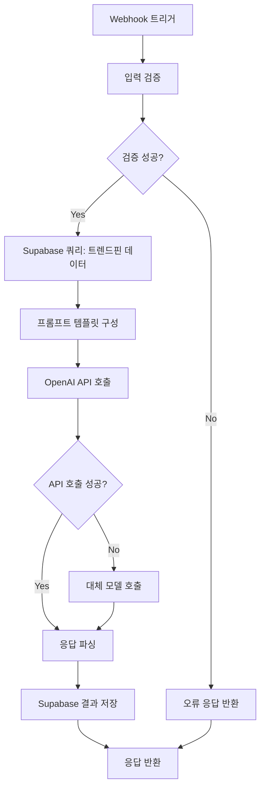
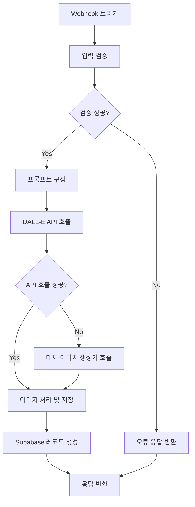
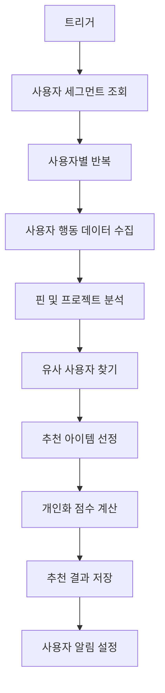
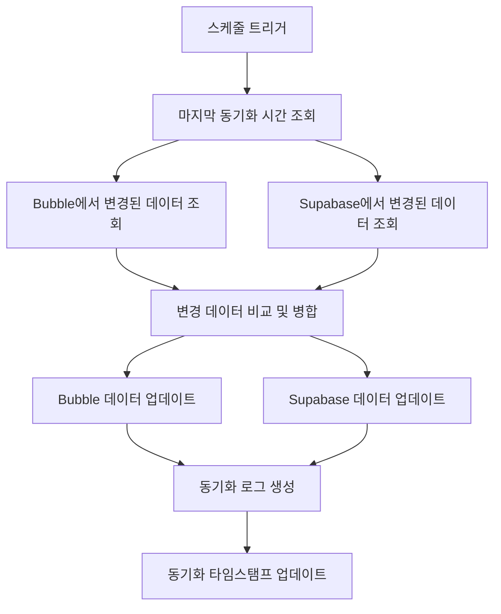
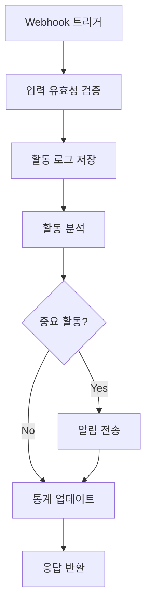
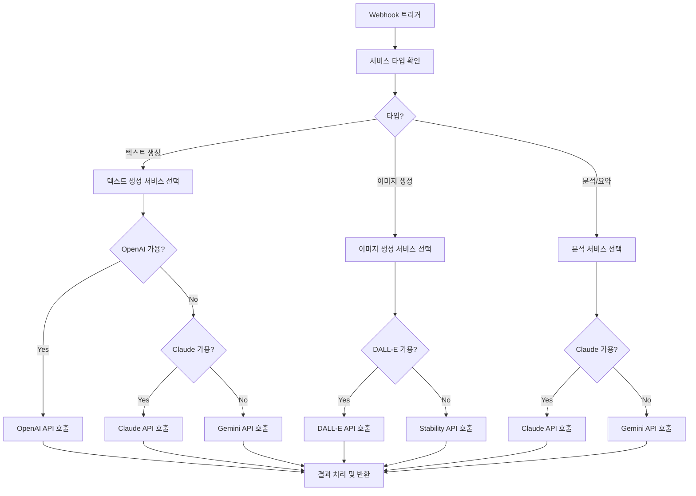
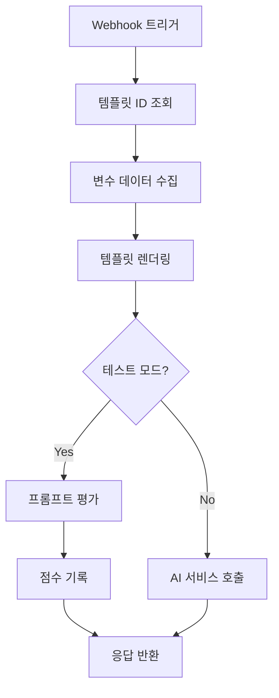

# 바이브-플레이(Vibe-Play) n8n 워크플로우 명세서

## 1. n8n 개요 및 역할

n8n은 바이브-플레이 플랫폼에서 다음과 같은 핵심 역할을 수행합니다:

1. **API 서비스 통합**: 다양한 AI 서비스(OpenAI, Claude, Gemini, DALL-E 등)와의 통신 중개
2. **데이터 처리 파이프라인**: 트렌드 데이터 수집, 처리, 저장 자동화
3. **백엔드 작업 자동화**: 주기적인 데이터 업데이트, 알림 발송 등 관리
4. **Bubble.io와 Supabase 연동**: 두 플랫폼 간 데이터 동기화 및 통합

이 문서는 주요 n8n 워크플로우의 설계, 구현 방법, 그리고 연동 지점을 설명합니다.

## 2. n8n 환경 설정

### 2.1. 서버 설정

**호스팅 옵션**:
- n8n Cloud (초기 개발 및 MVP)
- 자체 호스팅 (확장 단계)

**권장 사양** (자체 호스팅 시):
- CPU: 2 코어 이상
- 메모리: 4GB 이상
- 디스크: SSD 20GB 이상
- 운영체제: Ubuntu 20.04 LTS

**필수 환경변수**:
```
# 기본 설정
N8N_PORT=5678
N8N_PROTOCOL=https
N8N_HOST=n8n.your-domain.com
N8N_ENCRYPTION_KEY=your-encryption-key

# 외부 서비스 API 키
OPENAI_API_KEY=sk-...
ANTHROPIC_API_KEY=sk-ant-...
GOOGLE_API_KEY=...
STABILITY_API_KEY=...

# Supabase 연결 정보
SUPABASE_URL=https://your-project.supabase.co
SUPABASE_SERVICE_ROLE_KEY=eyJ...
SUPABASE_ANON_KEY=eyJ...

# 보안
JWT_SECRET=your-jwt-secret
```

### 2.2. 중앙 관리형 자격 증명

**자격 증명 설정**:
- Supabase: 관리자 액세스를 위한 service_role 키 사용
- OpenAI: API 키 및 조직 ID 설정
- Anthropic: API 키 설정
- Bubble.io: API 워크플로우 엔드포인트 및 인증 정보

## 3. 핵심 워크플로우 설계

### 3.1. AI 제안 생성 워크플로우

**워크플로우 이름**: `vibe-play-ai-concept-generator`

**트리거**: Webhook (Bubble.io에서 호출)

**입력 파라미터**:
- projectId: UUID
- userId: UUID
- basicConcept: 문자열 (사용자 입력 기본 컨셉)
- targetAudience: 문자열 (타겟 고객층)
- productType: 문자열 (제품 유형)
- selectedPins: UUID 배열 (선택된 트렌드 핀 ID)

**워크플로우 다이어그램**:


**주요 노드 설명**:

1. **Webhook 트리거**:
   - 엔드포인트: `/api/v1/ai/generate-concept`
   - 인증: Bearer Token 인증
   - 응답 모드: 비동기 (프로세싱 중인 동안 Webhook 응답 유지)

2. **입력 검증 (Function 노드)**:
   ```javascript
   const projectId = $input.body.projectId;
   const userId = $input.body.userId;
   const basicConcept = $input.body.basicConcept;
   const productType = $input.body.productType;
   
   if (!projectId || !userId || !basicConcept) {
     return { valid: false, error: "필수 입력값이 누락되었습니다." };
   }
   
   return { 
     valid: true, 
     data: { projectId, userId, basicConcept, productType, selectedPins: $input.body.selectedPins || [] } 
   };
   ```

3. **Supabase 쿼리 (Supabase 노드)**:
   - 작업: Select
   - 스키마: vibe_play
   - 테이블: trend_cards
   - 필터: id IN selectedPins
   - 필드: title, description, category, tags

4. **프롬프트 구성 (Function 노드)**:
   ```javascript
   const trendData = $node["Supabase"].json;
   const { basicConcept, productType, targetAudience } = $node["입력 검증"].json.data;
   
   // 트렌드 정보 포맷팅
   const trendInfo = trendData.map(trend => 
     `- ${trend.title}: ${trend.description} (카테고리: ${trend.category})`
   ).join('\n');
   
   const prompt = `
   역할: 당신은 혁신적인 화장품 제품 컨셉과 마케팅 전략을 개발하는 전문가입니다.
   
   입력 정보:
   - 기본 아이디어: ${basicConcept}
   - 제품 카테고리: ${productType || '미지정'}
   - 타겟 고객: ${targetAudience || '일반 소비자'}
   - 참고 트렌드: ${trendInfo || '참고 트렌드 없음'}
   
   다음 형식으로 응답해주세요:
   
   제품명 후보:
   1. [제품명 1]
   2. [제품명 2]
   3. [제품명 3]
   4. [제품명 4]
   5. [제품명 5]
   
   컨셉 요약:
   [50-100단어 분량의 컨셉 설명]
   
   주요 마케팅 포인트:
   • [마케팅 포인트 1]
   • [마케팅 포인트 2]
   • [마케팅 포인트 3]
   • [마케팅 포인트 4]
   • [마케팅 포인트 5]
   
   USP(핵심 차별화 요소):
   [제품의 가장 강력한 차별화 포인트]
   `;
   
   return { prompt };
   ```

5. **OpenAI API 호출 (OpenAI 노드)**:
   - 모델: gpt-4
   - 프롬프트: $node["프롬프트 구성"].json.prompt
   - 온도: 0.7
   - 최대 토큰: 1200
   - 프레즌스 페널티: 0.0
   - 프리퀀시 페널티: 0.5

6. **응답 파싱 (Function 노드)**:
   ```javascript
   const aiResponse = $node["OpenAI"].json.choices[0].text.trim();
   
   // 정규식으로 각 섹션 추출
   const productNameSection = aiResponse.match(/제품명 후보:[\s\S]*?(?=\n\n컨셉 요약:)/);
   const conceptSection = aiResponse.match(/컨셉 요약:[\s\S]*?(?=\n\n주요 마케팅 포인트:)/);
   const marketingPointsSection = aiResponse.match(/주요 마케팅 포인트:[\s\S]*?(?=\n\nUSP)/);
   const uspSection = aiResponse.match(/USP.*?:[\s\S]*/);
   
   // 제품명 파싱
   const productNames = productNameSection ? 
     productNameSection[0].replace('제품명 후보:', '').trim()
       .split('\n')
       .filter(line => line.trim().length > 0)
       .map(line => line.replace(/^\d+\.\s*/, '').trim()) : 
     [];
   
   // 컨셉 요약 파싱
   const concept = conceptSection ? 
     conceptSection[0].replace('컨셉 요약:', '').trim() : 
     '';
   
   // 마케팅 포인트 파싱
   const marketingPoints = marketingPointsSection ? 
     marketingPointsSection[0].replace('주요 마케팅 포인트:', '').trim()
       .split('\n')
       .filter(line => line.trim().length > 0)
       .map(line => line.replace(/^•\s*/, '').trim()) : 
     [];
   
   // USP 파싱
   const usp = uspSection ? 
     uspSection[0].replace(/USP.*?:/, '').trim() : 
     '';
   
   return {
     product_names: productNames,
     concept_summary: concept,
     marketing_points: marketingPoints,
     usp: usp,
     raw_response: aiResponse
   };
   ```

7. **Supabase 결과 저장 (Supabase 노드)**:
   - 작업: Insert
   - 스키마: vibe_play
   - 테이블: ai_suggestions
   - 데이터: 
     ```json
     {
       "project_id": "{{$node[\"입력 검증\"].json.data.projectId}}",
       "suggestion_type": "concept",
       "input_parameters": {
         "basicConcept": "{{$node[\"입력 검증\"].json.data.basicConcept}}",
         "productType": "{{$node[\"입력 검증\"].json.data.productType}}",
         "selectedPins": "{{$node[\"입력 검증\"].json.data.selectedPins}}"
       },
       "results": "{{$node[\"응답 파싱\"].json}}",
       "model_used": "gpt-4",
       "created_at": "{{$now}}"
     }
     ```

8. **응답 반환 (Respond to Webhook 노드)**:
   - 상태 코드: 200
   - 응답 바디: $node["응답 파싱"].json
   - 헤더: Content-Type: application/json

### 3.2. 무드보드 이미지 생성 워크플로우

**워크플로우 이름**: `vibe-play-moodboard-generator`

**트리거**: Webhook (Bubble.io에서 호출)

**입력 파라미터**:
- projectId: UUID
- conceptSummary: 문자열 (제품 컨셉 요약)
- styleKeywords: 문자열 배열 (스타일 키워드)
- colorPalette: 문자열 (선호 색상, 예: "#FF5733, #33FF57")
- imageCount: 숫자 (생성할 이미지 수, 기본값: 1)

**워크플로우 다이어그램**:


**주요 노드 설명**:

1. **입력 검증 (Function 노드)**:
   ```javascript
   const projectId = $input.body.projectId;
   const conceptSummary = $input.body.conceptSummary;
   const styleKeywords = $input.body.styleKeywords || [];
   const colorPalette = $input.body.colorPalette || "";
   const imageCount = $input.body.imageCount || 1;
   
   if (!projectId || !conceptSummary) {
     return { valid: false, error: "필수 입력값이 누락되었습니다." };
   }
   
   // 이미지 수 제한 (비용 제어)
   const validImageCount = Math.min(Math.max(1, imageCount), 4);
   
   return { 
     valid: true, 
     data: { 
       projectId, 
       conceptSummary, 
       styleKeywords, 
       colorPalette,
       imageCount: validImageCount 
     } 
   };
   ```

2. **프롬프트 구성 (Function 노드)**:
   ```javascript
   const { conceptSummary, styleKeywords, colorPalette } = $node["입력 검증"].json.data;
   
   // 스타일 키워드 문자열 변환
   const styleText = styleKeywords.length > 0 
     ? styleKeywords.join(", ") 
     : "modern, clean, professional";
   
   // 컬러 팔레트 처리
   const colorText = colorPalette 
     ? `주요 색상: ${colorPalette}` 
     : "";
   
   const prompt = `
   제품 무드보드 이미지를 생성해주세요:
   
   컨셉: ${conceptSummary}
   스타일: ${styleText}
   ${colorText}
   
   다음 요소를 포함한 무드보드를 만들어주세요:
   - 주요 컬러 팔레트를 시각적으로 표현
   - 제품과 연관된 추상적 이미지나 텍스처
   - 컨셉을 표현하는 타이포그래피 힌트
   - 전체적으로 조화롭고 세련된 디자인
   
   이미지 스타일: 현대적이고 깔끔한 무드보드, 화장품 브랜딩에 적합한 프로페셔널한 룩
   해상도: 1024x1024
   `;
   
   return { prompt };
   ```

3. **DALL-E API 호출 (OpenAI 노드)**:
   - 모델: dall-e-3
   - 프롬프트: $node["프롬프트 구성"].json.prompt
   - 이미지 수: $node["입력 검증"].json.data.imageCount
   - 사이즈: 1024x1024
   - 품질: standard
   - 스타일: vivid

4. **이미지 처리 및 저장 (Function & HTTP Request 노드)**:
   ```javascript
   // 이미지 URL 추출
   const imageResults = $node["OpenAI"].json.data;
   const imageUrls = imageResults.map(img => img.url);
   
   // 이미지 처리 결과
   const processedImages = [];
   
   // 각 이미지에 대해 처리
   for (let i = 0; i < imageUrls.length; i++) {
     const imageUrl = imageUrls[i];
     
     // 이미지 다운로드
     const response = await fetch(imageUrl);
     const imageBuffer = await response.arrayBuffer();
     const base64Image = Buffer.from(imageBuffer).toString('base64');
     
     // 파일명 생성
     const fileName = `moodboard_${$node["입력 검증"].json.data.projectId}_${Date.now()}_${i}.png`;
     
     // Supabase Storage에 업로드 정보 준비
     processedImages.push({
       fileName,
       contentType: 'image/png',
       base64Data: base64Image
     });
   }
   
   return { processedImages };
   ```

5. **Supabase Storage 업로드 (HTTP Request 노드)**:
   - 메서드: POST
   - URL: {{$json["supabaseUrl"]}}/storage/v1/object/project-images/{{$json["fileName"]}}
   - 헤더:
     - Authorization: Bearer {{$json["supabaseServiceKey"]}}
     - Content-Type: {{$json["contentType"]}}
   - 바디: 바이너리 데이터 (base64 디코딩된 이미지)

6. **Supabase 레코드 생성 (Supabase 노드)**:
   - 작업: Insert
   - 스키마: vibe_play
   - 테이블: moodboards
   - 데이터:
     ```json
     {
       "project_id": "{{$node[\"입력 검증\"].json.data.projectId}}",
       "name": "AI 생성 무드보드 {{$now}}",
       "image_url": "{{$node[\"Supabase Storage 업로드\"].json.Key}}",
       "generation_parameters": {
         "concept": "{{$node[\"입력 검증\"].json.data.conceptSummary}}",
         "style": "{{$node[\"입력 검증\"].json.data.styleKeywords}}",
         "colors": "{{$node[\"입력 검증\"].json.data.colorPalette}}"
       },
       "created_at": "{{$now}}"
     }
     ```

### 3.3. 트렌드 데이터 수집 및 처리 워크플로우

**워크플로우 이름**: `vibe-play-trend-data-collector`

**트리거**: 스케줄 (매일 실행)

**워크플로우 다이어그램**:
```mermaid
flowchart TD
    A[스케줄 트리거] --> B1[뷰티 뉴스 API 호출]
    A --> B2[소셜 미디어 트렌드 API 호출]
    A --> B3[시장 보고서 API 호출]
    B1 --> C[데이터 병합 및 중복 제거]
    B2 --> C
    B3 --> C
    C --> D[텍스트 전처리]
    D --> E[Claude API: 트렌드 분석]
    E --> F[응답 파싱 및 구조화]
    F --> G{중요도 분류}
    G -->|높음| H1[주요 트렌드 카드 생성]
    G -->|중간| H2[보조 트렌드 카드 생성]
    G -->|낮음| I[데이터 저장 (참고용)]
    H1 --> J[Supabase 업데이트]
    H2 --> J
    I --> J
```

**주요 노드 설명**:

1. **트렌드 데이터 수집 (HTTP Request 노드들)**:
   - 뷰티 뉴스 API (예: NewsAPI)
   - 소셜 미디어 트렌드 (예: Reddit API, Twitter API)
   - 시장 보고서 요약 (사내 데이터 API)

2. **데이터 병합 및 전처리 (Function 노드)**:
   ```javascript
   const beautyNews = $node["뷰티 뉴스 API"].json.articles;
   const socialTrends = $node["소셜 미디어 API"].json.data;
   const marketReports = $node["시장 보고서 API"].json.reports;
   
   // 데이터 병합 및 표준화
   const allSources = [
     ...beautyNews.map(item => ({
       source: "news",
       title: item.title,
       content: item.description + " " + (item.content || ""),
       url: item.url,
       published_at: item.publishedAt,
       image_url: item.urlToImage
     })),
     ...socialTrends.map(item => ({
       source: "social",
       title: item.title || "Social Trend",
       content: item.text,
       url: item.permalink,
       published_at: item.created_utc,
       image_url: item.thumbnail || null
     })),
     ...marketReports.map(item => ({
       source: "report",
       title: item.title,
       content: item.summary,
       url: item.url,
       published_at: item.date,
       image_url: item.cover_image
     }))
   ];
   
   // 중복 제거 (URL 기준)
   const uniqueSources = [];
   const urls = new Set();
   
   for (const item of allSources) {
     if (item.url && !urls.has(item.url)) {
       urls.add(item.url);
       uniqueSources.push(item);
     }
   }
   
   // 키워드 필터링 (관련 내용만 포함)
   const relevantKeywords = [
     "skincare", "cosmetics", "beauty", "ingredients", "packaging", 
     "formulation", "vegan", "clean beauty", "sustainable"
   ];
   
   const relevantSources = uniqueSources.filter(item => {
     const text = (item.title + " " + item.content).toLowerCase();
     return relevantKeywords.some(keyword => text.includes(keyword));
   });
   
   return { sources: relevantSources };
   ```

3. **Claude API 트렌드 분석 (HTTP Request 노드)**:
   - 메서드: POST
   - URL: https://api.anthropic.com/v1/messages
   - 헤더:
     - x-api-key: {{$credentials["anthropic"].key}}
     - content-type: application/json
   - 바디:
     ```json
     {
       "model": "claude-3-sonnet-20240229",
       "max_tokens": 1024,
       "messages": [
         {
           "role": "user",
           "content": "역할: 당신은 화장품/뷰티 산업의 최신 트렌드를 분석하고 요약하는 전문가입니다.\n\n다음 데이터를 분석해주세요:\n{{$json.sources | json}}\n\n분석 요청:\n1. 이 데이터에서 파악되는 주요 트렌드를 식별해주세요 (최대 5개).\n2. 각 트렌드의 중요성과 성장 가능성을 평가해주세요.\n3. 트렌드가 적용될 수 있는 제품 카테고리를 제안해주세요.\n\n다음 형식으로 각 트렌드에 대한 트렌드 카드를 작성해주세요:\n\n--- 트렌드 카드 ---\n제목: [명확하고 간결한 트렌드 이름]\n카테고리: [ingredient/packaging/formulation/concept/marketing/design 중 선택]\n설명: [100-150단어 분량의 트렌드 설명]\n주요 특징:\n• [특징 1]\n• [특징 2]\n• [특징 3]\n관련 제품 카테고리: [적용 가능한 제품 유형]\n예상 성장률: [high/medium/low]\n추천 태그: [관련 키워드 5-7개]"
         }
       ]
     }
     ```

4. **응답 파싱 및 구조화 (Function 노드)**:
   ```javascript
   const claudeResponse = $node["Claude API"].json.content[0].text;
   
   // 트렌드 카드 분리
   const trendCards = claudeResponse.split("--- 트렌드 카드 ---")
     .filter(card => card.trim().length > 0)
     .map(card => card.trim());
   
   const parsedCards = trendCards.map(card => {
     // 정규식으로 각 섹션 추출
     const titleMatch = card.match(/제목:\s*(.+)(?=\n)/);
     const categoryMatch = card.match(/카테고리:\s*(.+)(?=\n)/);
     const descriptionMatch = card.match(/설명:\s*([^]*?)(?=\n주요 특징:)/);
     const featuresMatch = card.match(/주요 특징:\n([^]*?)(?=\n관련 제품 카테고리:)/);
     const productCategoryMatch = card.match(/관련 제품 카테고리:\s*(.+)(?=\n)/);
     const growthMatch = card.match(/예상 성장률:\s*(.+)(?=\n)/);
     const tagsMatch = card.match(/추천 태그:\s*(.+)(?=\n|$)/);
     
     // 특징 목록 파싱
     const features = featuresMatch ? 
       featuresMatch[1].split('\n')
         .map(f => f.trim())
         .filter(f => f.startsWith('•'))
         .map(f => f.replace(/^•\s*/, ''))
       : [];
     
     // 태그 파싱
     const tags = tagsMatch ? 
       tagsMatch[1].split(',').map(tag => tag.trim()) : 
       [];
     
     return {
       title: titleMatch ? titleMatch[1].trim() : "Untitled Trend",
       category: categoryMatch ? categoryMatch[1].trim().toLowerCase() : "concept",
       description: descriptionMatch ? descriptionMatch[1].trim() : "",
       features: features,
       product_category: productCategoryMatch ? productCategoryMatch[1].trim() : "",
       growth_rate: growthMatch ? growthMatch[1].trim().toLowerCase() : "medium",
       tags: tags,
       raw_card: card
     };
   });
   
   return { trendCards: parsedCards };
   ```

5. **Supabase 업데이트 (Supabase 노드)**:
   - 작업: Insert (매 트렌드 카드마다 반복)
   - 스키마: vibe_play
   - 테이블: trend_cards
   - 데이터:
     ```json
     {
       "title": "{{$json[\"title\"]}}",
       "description": "{{$json[\"description\"]}}",
       "category": "{{$json[\"category\"]}}",
       "subcategory": null,
       "image_url": "https://placeholder.com/600x400",
       "source_url": "AI generated",
       "popularity_score": "{{$json[\"growth_rate\"] === 'high' ? 8 : $json[\"growth_rate\"] === 'medium' ? 5 : 3}}",
       "tags": "{{$json[\"tags\"]}}",
       "created_at": "{{$now}}",
       "is_active": true
     }
     ```

6. **이미지 생성 서브워크플로우 (후속 단계)**:
   - 각 트렌드 카드에 적합한 이미지 생성 (DALL-E)
   - 이미지 URL 업데이트

### 3.4. 사용자 개인화 추천 워크플로우

**워크플로우 이름**: `vibe-play-personalized-recommendations`

**트리거**: 스케줄 (매일 1회) 또는 이벤트 기반 (프로젝트 생성 시)

**워크플로우 다이어그램**:


**주요 노드 설명**:

1. **사용자 세그먼트 조회 (Supabase 노드)**:
   - 작업: Select
   - 스키마: vibe_play
   - 테이블: users
   - 필터: last_login > NOW() - INTERVAL '14 days'
   - 필드: id, email, full_name

2. **사용자 행동 데이터 수집 (Function & Supabase 노드)**:
   ```javascript
   const userId = $node["사용자별 반복"].json.id;
   
   // 1. 마이핀 데이터 조회
   const pinQuery = {
     operation: "select",
     schema: "vibe_play",
     table: "user_pins",
     options: {
       select: ["*", "trend_card:trend_cards(title,category,tags)"],
       filter: { user_id: { eq: userId } }
     }
   };
   
   // 2. 프로젝트 데이터 조회
   const projectQuery = {
     operation: "select",
     schema: "vibe_play",
     table: "projects",
     options: {
       select: ["*", "project_concepts(target_audience,core_concept,product_type)"],
       filter: { user_id: { eq: userId } }
     }
   };
   
   return { 
     userId,
     pinQuery,
     projectQuery
   };
   ```

3. **추천 아이템 선정 (Function 노드)**:
   ```javascript
   const userId = $node["사용자 행동 데이터 수집"].json.userId;
   const pins = $node["마이핀 데이터 조회"].json;
   const projects = $node["프로젝트 데이터 조회"].json;
   
   // 관심 카테고리 분석
   const categoryInterests = {};
   pins.forEach(pin => {
     const category = pin.trend_card.category;
     categoryInterests[category] = (categoryInterests[category] || 0) + 1;
   });
   
   // 사용자 관심 태그 추출
   const tagInterests = new Map();
   pins.forEach(pin => {
     pin.trend_card.tags.forEach(tag => {
       tagInterests.set(tag, (tagInterests.get(tag) || 0) + 1);
     });
   });
   
   // 상위 관심 태그 (최대 10개)
   const topTags = [...tagInterests.entries()]
     .sort((a, b) => b[1] - a[1])
     .slice(0, 10)
     .map(entry => entry[0]);
   
   // 관심 제품 유형 추출
   const productTypes = new Set();
   projects.forEach(project => {
     if (project.project_concepts && project.project_concepts.length > 0) {
       const productType = project.project_concepts[0].product_type;
       if (productType) productTypes.add(productType);
     }
   });
   
   return { 
     userId,
     categoryInterests,
     topTags: topTags,
     productTypes: Array.from(productTypes)
   };
   ```

4. **추천 트렌드 조회 (Supabase 노드)**:
   - 작업: Select
   - 스키마: vibe_play
   - 테이블: trend_cards
   - 필터: 
     ```
     (
       category IN {{$node["추천 아이템 선정"].json.categoryInterests | keys}}
       OR 
       tags && {{$node["추천 아이템 선정"].json.topTags}}
     )
     AND
     id NOT IN (
       SELECT trend_card_id FROM vibe_play.user_pins
       WHERE user_id = {{$node["추천 아이템 선정"].json.userId}}
     )
     ```
   - 정렬: popularity_score DESC
   - 제한: 10

5. **추천 결과 저장 (Supabase 노드)**:
   - 작업: Insert
   - 스키마: vibe_play
   - 테이블: user_recommendations
   - 데이터:
     ```json
     {
       "user_id": "{{$node[\"추천 아이템 선정\"].json.userId}}",
       "trend_cards": "{{$node[\"추천 트렌드 조회\"].json.map(t => t.id)}}",
       "recommendation_reason": "Based on your interests in {{$node[\"추천 아이템 선정\"].json.categoryInterests | keys | join(\", \")}}",
       "created_at": "{{$now}}",
       "is_viewed": false
     }
     ```

## 4. 데이터 동기화 워크플로우

### 4.1. Bubble.io와 Supabase 양방향 동기화

**워크플로우 이름**: `vibe-play-data-sync`

**트리거**: 스케줄 (10분마다 실행)

**워크플로우 다이어그램**:


**주요 구현 포인트**:

1. **마지막 동기화 시간 관리**:
   - Supabase의 `system_settings` 테이블에서 관리
   - 각 엔티티별 동기화 시간 기록

2. **변경 감지 방법**:
   - Bubble: API 워크플로우를 통해 timestamp 기반 변경 데이터 조회
   - Supabase: `updated_at` 필드 기준으로 변경 데이터 조회

3. **충돌 해결 전략**:
   - 타임스탬프 비교 후 최신 데이터 우선
   - 필드별 중요도에 따른 우선순위 설정
   - 로그 기록으로 충돌 추적

### 4.2. 사용자 활동 로그 워크플로우

**워크플로우 이름**: `vibe-play-user-activity-logger`

**트리거**: Webhook (Bubble.io에서 중요 사용자 액션 발생 시)

**입력 파라미터**:
- userId: UUID
- action: 문자열 (예: "project_created", "trend_pinned")
- entityId: UUID (관련 엔티티 ID)
- details: 객체 (추가 상세 정보)

**워크플로우 다이어그램**:


**주요 노드 설명**:

1. **활동 로그 저장 (Supabase 노드)**:
   - 작업: Insert
   - 스키마: vibe_play
   - 테이블: user_activity_logs
   - 데이터:
     ```json
     {
       "user_id": "{{$node[\"입력 유효성 검증\"].json.data.userId}}",
       "action": "{{$node[\"입력 유효성 검증\"].json.data.action}}",
       "entity_type": "{{$node[\"입력 유효성 검증\"].json.data.action.split('_')[0]}}",
       "entity_id": "{{$node[\"입력 유효성 검증\"].json.data.entityId}}",
       "details": "{{$node[\"입력 유효성 검증\"].json.data.details}}",
       "created_at": "{{$now}}"
     }
     ```

2. **활동 분석 (Function 노드)**:
   ```javascript
   const { userId, action, entityId } = $node["입력 유효성 검증"].json.data;
   
   // 중요 활동 정의
   const importantActions = [
     "project_created",
     "project_completed",
     "ai_suggestion_requested",
     "moodboard_created"
   ];
   
   // 알림이 필요한 중요 활동인지 확인
   const isImportantActivity = importantActions.includes(action);
   
   // 알림 메시지 구성
   let notificationMessage = "";
   if (isImportantActivity) {
     switch (action) {
       case "project_created":
         notificationMessage = "새 프로젝트가 생성되었습니다.";
         break;
       case "project_completed":
         notificationMessage = "프로젝트가 완료되었습니다.";
         break;
       case "ai_suggestion_requested":
         notificationMessage = "AI 제안이 요청되었습니다.";
         break;
       case "moodboard_created":
         notificationMessage = "새 무드보드가 생성되었습니다.";
         break;
     }
   }
   
   return { 
     isImportantActivity, 
     notificationMessage,
     userId,
     entityId,
     action
   };
   ```

3. **알림 전송 (Conditional & HTTP Request 노드)**:
   - 조건: $node["활동 분석"].json.isImportantActivity === true
   - HTTP Request (Bubble.io API 호출):
     - 메서드: POST
     - URL: {{$json["bubbleApiUrl"]}}/api/1.1/wf/send_notification
     - 헤더:
       - Authorization: Bearer {{$json["bubbleApiToken"]}}
       - Content-Type: application/json
     - 바디:
       ```json
       {
         "userId": "{{$node[\"활동 분석\"].json.userId}}",
         "message": "{{$node[\"활동 분석\"].json.notificationMessage}}",
         "entityId": "{{$node[\"활동 분석\"].json.entityId}}",
         "entityType": "{{$node[\"활동 분석\"].json.action.split('_')[0]}}"
       }
       ```

## 5. AI 통합 워크플로우

### 5.1. AI 모델 선택 및 폴백 전략

**워크플로우 이름**: `vibe-play-ai-service-manager`

**목적**: AI 서비스 가용성 및 비용 관리를 위한 중앙 관리 워크플로우

**워크플로우 다이어그램**:


**주요 구현 포인트**:

1. **서비스 가용성 확인 (Function 노드)**:
   ```javascript
   const serviceType = $input.body.serviceType; // "text", "image", "analysis"
   const serviceConfig = {
     text: [
       { name: "openai", priority: 1, model: "gpt-4", available: true },
       { name: "claude", priority: 2, model: "claude-3-sonnet", available: true },
       { name: "gemini", priority: 3, model: "gemini-1.5-pro", available: true }
     ],
     image: [
       { name: "dalle", priority: 1, model: "dall-e-3", available: true },
       { name: "stability", priority: 2, model: "stable-diffusion-xl", available: true }
     ],
     analysis: [
       { name: "claude", priority: 1, model: "claude-3-opus", available: true },
       { name: "openai", priority: 2, model: "gpt-4", available: true },
       { name: "gemini", priority: 3, model: "gemini-1.5-pro", available: true }
     ]
   };
   
   // 가용성 체크 (실제로는 API 상태 확인 또는 사용량 제한 확인 로직 추가)
   // 예시: OpenAI 사용량이 일일 한도에 도달한 경우 available = false로 설정
   
   // 우선순위에 따라 사용 가능한 첫 번째 서비스 선택
   const services = serviceConfig[serviceType] || serviceConfig.text;
   const selectedService = services.filter(s => s.available).sort((a, b) => a.priority - b.priority)[0];
   
   if (!selectedService) {
     return { error: "현재 사용 가능한 AI 서비스가 없습니다." };
   }
   
   return { 
     serviceType,
     selectedService,
     prompt: $input.body.prompt,
     parameters: $input.body.parameters || {}
   };
   ```

2. **AI API 호출 (Switch 노드 및 API 노드들)**:
   - Switch 노드: $node["서비스 가용성 확인"].json.selectedService.name
   - 각 케이스별 적절한 API 노드 연결

3. **결과 표준화 (Function 노드)**:
   ```javascript
   const serviceType = $node["서비스 가용성 확인"].json.serviceType;
   const selectedService = $node["서비스 가용성 확인"].json.selectedService.name;
   
   let result;
   
   // 서비스별 응답 구조 표준화
   if (serviceType === "text") {
     if (selectedService === "openai") {
       result = {
         text: $node["OpenAI API"].json.choices[0].message.content,
         model: $node["OpenAI API"].json.model,
         service: "openai"
       };
     } else if (selectedService === "claude") {
       result = {
         text: $node["Claude API"].json.content[0].text,
         model: $node["Claude API"].json.model,
         service: "claude"
       };
     } else if (selectedService === "gemini") {
       result = {
         text: $node["Gemini API"].json.candidates[0].content.parts[0].text,
         model: $node["Gemini API"].json.model,
         service: "gemini"
       };
     }
   } else if (serviceType === "image") {
     if (selectedService === "dalle") {
       result = {
         images: $node["DALL-E API"].json.data.map(img => img.url),
         model: "dall-e-3",
         service: "openai"
       };
     } else if (selectedService === "stability") {
       result = {
         images: $node["Stability API"].json.artifacts.map(img => img.base64),
         model: "stable-diffusion-xl",
         service: "stability"
       };
     }
   }
   
   return { result };
   ```

### 5.2. 프롬프트 관리 워크플로우

**워크플로우 이름**: `vibe-play-prompt-manager`

**목적**: 프롬프트 템플릿 관리 및 최적화

**워크플로우 다이어그램**:


**주요 노드 설명**:

1. **템플릿 조회 (Supabase 노드)**:
   - 작업: Select
   - 스키마: vibe_play
   - 테이블: prompt_templates
   - 필터: id = $input.body.templateId
   - 필드: id, name, template, default_variables, service_type, model_preference

2. **변수 데이터 수집 (Function 노드)**:
   ```javascript
   const template = $node["템플릿 조회"].json[0];
   const userVariables = $input.body.variables || {};
   
   // 기본 변수와 사용자 제공 변수 병합
   const defaultVariables = template.default_variables || {};
   const variables = { ...defaultVariables, ...userVariables };
   
   // 필수 변수 검증
   const requiredVariables = template.template.match(/\{\{([^}]+)\}\}/g) || [];
   const missingVariables = [];
   
   for (const variable of requiredVariables) {
     const varName = variable.replace(/\{\{|\}\}/g, '').trim();
     if (!variables.hasOwnProperty(varName)) {
       missingVariables.push(varName);
     }
   }
   
   if (missingVariables.length > 0) {
     return {
       error: `다음 필수 변수가 누락되었습니다: ${missingVariables.join(', ')}`
     };
   }
   
   return { 
     template: template.template,
     variables,
     serviceType: template.service_type,
     modelPreference: template.model_preference,
     isTestMode: $input.body.testMode || false
   };
   ```

3. **템플릿 렌더링 (Function 노드)**:
   ```javascript
   const { template, variables } = $node["변수 데이터 수집"].json;
   
   // 변수 치환
   let renderedPrompt = template;
   for (const [key, value] of Object.entries(variables)) {
     const regex = new RegExp(`\\{\\{\\s*${key}\\s*\\}\\}`, 'g');
     renderedPrompt = renderedPrompt.replace(regex, value);
   }
   
   return { 
     renderedPrompt,
     serviceType: $node["변수 데이터 수집"].json.serviceType,
     modelPreference: $node["변수 데이터 수집"].json.modelPreference,
     isTestMode: $node["변수 데이터 수집"].json.isTestMode
   };
   ```

4. **프롬프트 평가 (Conditional & HTTP Request 노드)**:
   - 조건: $node["템플릿 렌더링"].json.isTestMode === true
   - HTTP Request (Claude API 호출):
     - 메서드: POST
     - URL: https://api.anthropic.com/v1/messages
     - 헤더:
       - x-api-key: {{$credentials["anthropic"].key}}
       - content-type: application/json
     - 바디:
       ```json
       {
         "model": "claude-3-sonnet-20240229",
         "max_tokens": 500,
         "messages": [
           {
             "role": "user",
             "content": "당신은 프롬프트 품질 평가 전문가입니다. 다음 프롬프트의 품질을 1-10 스케일로 평가하고 개선점을 제안해주세요. 평가 기준은 명확성, 구체성, 목적 부합성입니다.\n\n프롬프트:\n{{$node[\"템플릿 렌더링\"].json.renderedPrompt}}\n\n평가는 다음 형식으로 제공해주세요:\n\n점수: [1-10]\n강점:\n- [강점 1]\n- [강점 2]\n약점:\n- [약점 1]\n- [약점 2]\n개선 제안:\n- [제안 1]\n- [제안 2]"
           }
         ]
       }
       ```

5. **AI 서비스 호출 (HTTP Request 노드)**:
   - 이 단계에서는 `vibe-play-ai-service-manager` 워크플로우 호출
   - 입력: 렌더링된 프롬프트, 서비스 타입, 모델 선호도

## 6. 워크플로우 모니터링 및 오류 처리

### 6.1. 모니터링 워크플로우

**워크플로우 이름**: `vibe-play-workflow-monitor`

**트리거**: 스케줄 (시간당 1회)

**주요 기능**:
- 워크플로우 실행 상태 모니터링
- 오류 발생 시 알림 전송
- 성능 지표 수집 및 대시보드 업데이트

**구현 방식**:
1. n8n 내부 API를 통해 워크플로우 실행 상태 조회
2. 실패한 워크플로우 식별 및 로깅
3. Slack/이메일을 통한 알림 발송
4. 오류 패턴 분석 및 주기적 리포트 생성

### 6.2. 오류 복구 전략

**자동 재시도 메커니즘**:
- AI API 호출 실패 시 자동 재시도 (최대 3회)
- 점진적 백오프 적용 (지수적 대기 시간 증가)

**폴백 로직**:
- 주 AI 서비스 실패 시 대체 서비스로 전환
- 중요 워크플로우에 대한 백업 실행 경로 설정

**데이터 일관성 유지**:
- 트랜잭션 기반 작업 설계
- 상태 추적 및 부분 실패 복구

## 7. n8n 확장성 및 성능 최적화

### 7.1. 워크플로우 최적화 전략

**배치 처리**:
- 대량 데이터 처리 시 배치 작업으로 분할
- 병렬 실행을 통한 처리 속도 향상

**캐싱 전략**:
- AI 응답 결과 캐싱
- 자주 사용되는 데이터 쿼리 결과 캐싱

**리소스 효율성**:
- 메모리 사용량 최적화
- 장시간 실행 워크플로우 분할

### 7.2. 확장 계획

**부하 분산**:
- 중요 워크플로우를 위한 전용 워커
- 지역별 n8n 인스턴스 구성 (글로벌 확장 시)

**큐 시스템 통합**:
- Redis 또는 RabbitMQ 기반 큐 시스템 도입
- 장시간 실행 작업 관리

## 8. n8n 커스텀 노드 개발 계획

### 8.1. 계획된 커스텀 노드

| 노드명 | 기능 | 우선순위 |
|--------|------|----------|
| **VibePlayAPINode** | 바이브-플레이 내부 API 호출 통합 | 중간 |
| **ColorPaletteExtractor** | 이미지에서 색상 팔레트 추출 | 높음 |
| **IngredientCompatibility** | 화장품 성분 호환성 검사 | 높음 |
| **TrendScoreCalculator** | 트렌드 인기도 점수 계산 | 중간 |
| **FormulationGenerator** | 기본 화장품 제형 생성 | 낮음 |

### 8.2. 샘플 커스텀 노드 구현 (ColorPaletteExtractor)

**기능**: 이미지 URL을 입력받아 주요 색상 팔레트 추출

**구현 개요**:
```javascript
// nodes/ColorPaletteExtractor/ColorPaletteExtractor.node.ts
import { IExecuteFunctions } from 'n8n-core';
import { INodeExecutionData, INodeType, INodeTypeDescription } from 'n8n-workflow';
import * as ColorThief from 'colorthief';

export class ColorPaletteExtractor implements INodeType {
  description: INodeTypeDescription = {
    displayName: 'Color Palette Extractor',
    name: 'colorPaletteExtractor',
    group: ['transform'],
    version: 1,
    description: 'Extracts color palette from images',
    defaults: {
      name: 'Color Palette Extractor',
    },
    inputs: ['main'],
    outputs: ['main'],
    properties: [
      {
        displayName: 'Image URL',
        name: 'imageUrl',
        type: 'string',
        default: '',
        required: true,
        description: 'URL of the image to extract colors from',
      },
      {
        displayName: 'Number of Colors',
        name: 'colorCount',
        type: 'number',
        default: 5,
        required: true,
        description: 'Number of colors to extract (1-10)',
      },
      {
        displayName: 'Output Format',
        name: 'outputFormat',
        type: 'options',
        options: [
          {
            name: 'RGB Array',
            value: 'rgb',
            description: 'Returns colors as RGB arrays'
          },
          {
            name: 'Hex Codes',
            value: 'hex',
            description: 'Returns colors as HEX color codes'
          },
        ],
        default: 'hex',
        required: true,
      },
    ],
  };

  async execute(this: IExecuteFunctions): Promise<INodeExecutionData[][]> {
    const items = this.getInputData();
    const returnData: INodeExecutionData[] = [];

    for (let i = 0; i < items.length; i++) {
      const imageUrl = this.getNodeParameter('imageUrl', i) as string;
      const colorCount = this.getNodeParameter('colorCount', i) as number;
      const outputFormat = this.getNodeParameter('outputFormat', i) as string;
      
      try {
        // ColorThief 라이브러리를 사용하여 색상 추출
        const colorThief = new ColorThief();
        const imageElement = await this.loadImage(imageUrl);
        const colorPalette = colorThief.getPalette(imageElement, colorCount);
        
        // 출력 형식 변환
        let formattedPalette;
        if (outputFormat === 'hex') {
          formattedPalette = colorPalette.map(color => this.rgbToHex(color[0], color[1], color[2]));
        } else {
          formattedPalette = colorPalette;
        }
        
        // 결과 반환
        returnData.push({
          json: {
            palette: formattedPalette,
            dominant_color: formattedPalette[0],
            image_url: imageUrl
          }
        });
      } catch (error) {
        returnData.push({
          json: { 
            error: error.message,
            image_url: imageUrl
          }
        });
      }
    }

    return [returnData];
  }
  
  // 이미지 로드 함수
  async loadImage(url: string): Promise<HTMLImageElement> {
    return new Promise((resolve, reject) => {
      const img = new Image();
      img.crossOrigin = 'Anonymous';
      img.onload = () => resolve(img);
      img.onerror = () => reject(new Error('Failed to load image'));
      img.src = url;
    });
  }
  
  // RGB를 HEX로 변환하는 함수
  rgbToHex(r: number, g: number, b: number): string {
    return '#' + [r, g, b]
      .map(x => {
        const hex = x.toString(16);
        return hex.length === 1 ? '0' + hex : hex;
      })
      .join('');
  }
}
```

## 9. 통합 테스트 및 디버깅 전략

### 9.1. 워크플로우 테스트 자동화

**테스트 워크플로우 구현**:
- 각 핵심 워크플로우에 대한 테스트 케이스 자동 실행
- 입력 값 조합 테스트
- 경계 조건 및 오류 케이스 테스트

**테스트 데이터 관리**:
- 테스트 전용 데이터셋 구축
- 테스트 후 데이터 정리 자동화

### 9.2. 로깅 및 디버깅 전략

**구조화된 로깅**:
- 각 워크플로우 실행의 주요 단계 로깅
- 입력/출력 데이터 스냅샷 저장
- 성능 지표 수집

**원격 디버깅**:
- n8n 워크플로우 디버거 구성
- 특정 조건에서 상세 로깅 활성화
- 문제 발생 시 알림 및 진단 정보 제공

## 10. 배포 및 운영

### 10.1. 배포 환경 구성

**개발/테스트/프로덕션 환경 분리**:
- 개발 환경: 새로운 워크플로우 개발 및 테스트
- 테스트 환경: QA 및 통합 테스트
- 프로덕션 환경: 라이브 서비스

**환경별 구성 관리**:
- 환경 변수를 통한 설정 분리
- API 키 및 비밀 정보 안전한 관리

### 10.2. 운영 체크리스트

**일일 모니터링**:
- 실패한 워크플로우 확인
- API 호출량 및 비용 모니터링
- 성능 이슈 점검

**주간 유지보수**:
- 워크플로우 최적화 검토
- 비활성 워크플로우 정리
- 새로운 기능 배포 계획

**월간 검토**:
- 리소스 사용량 분석
- 확장성 요구사항 평가
- 비용 최적화 전략 검토