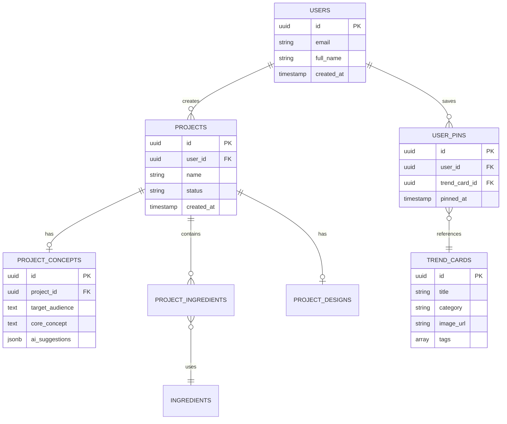

# 바이브-플레이(Vibe-Play) Supabase 통합 명세서

## 1. Supabase 개요

Supabase는 바이브-플레이 플랫폼의 백엔드 및 데이터베이스 레이어로 활용되며, PostgreSQL 데이터베이스, 사용자 인증, 스토리지, 실시간 구독 등 다양한 기능을 제공합니다. 이 문서는 Supabase 프로젝트 설정 및 주요 기능 구현 방법을 설명합니다.

## 2. Supabase 프로젝트 설정

### 2.1. 프로젝트 초기 설정

**Supabase 프로젝트 생성**:
1. Supabase 대시보드에서 새 프로젝트 생성
2. 프로젝트명: `vibe-play`
3. 데이터베이스 비밀번호 설정 (강력한 비밀번호 사용)
4. 지역: 가장 가까운 리전 (예: `northeast-asia-northeast-1`)
5. 요금제: 초기에는 무료 티어, 트래픽 증가시 Pro 또는 Team으로 업그레이드

**API 키 및 URL**:
- `anon` 키: 클라이언트측 Bubble.io에서 사용
- `service_role` 키: n8n 워크플로우 및 관리자 도구에서 사용 (높은 권한)
- Project URL: 모든 API 엔드포인트의 기본 URL

### 2.2. 보안 설정

**RLS(Row Level Security) 정책**:

모든 주요 테이블에 RLS 적용:

```sql
-- 예: 프로젝트 테이블 RLS
CREATE POLICY "사용자는 자신의 프로젝트만 볼 수 있음" 
ON projects FOR SELECT 
USING (auth.uid() = user_id);

CREATE POLICY "사용자는 자신의 프로젝트만 생성/수정/삭제할 수 있음" 
ON projects FOR ALL 
USING (auth.uid() = user_id);
```

**API 보안**:
- CORS 설정: Bubble.io 도메인 허용
- API 요청 속도 제한 설정
- 중요 API는 JWT 인증 필수

## 3. 데이터베이스 스키마 구현

### 3.1. 스키마 및 마이그레이션 전략

**초기 마이그레이션 SQL**:

```sql
-- 스키마 생성
CREATE SCHEMA vibe_play;

-- 기본 테이블
CREATE TABLE vibe_play.users (
  id UUID PRIMARY KEY DEFAULT auth.uid(),
  email TEXT NOT NULL UNIQUE,
  full_name TEXT,
  company_name TEXT,
  created_at TIMESTAMP WITH TIME ZONE DEFAULT NOW(),
  updated_at TIMESTAMP WITH TIME ZONE DEFAULT NOW(),
  last_login TIMESTAMP WITH TIME ZONE,
  account_status TEXT DEFAULT 'active',
  profile_image_url TEXT
);

CREATE TABLE vibe_play.projects (
  id UUID PRIMARY KEY DEFAULT uuid_generate_v4(),
  user_id UUID NOT NULL REFERENCES vibe_play.users(id) ON DELETE CASCADE,
  name TEXT NOT NULL,
  description TEXT,
  status TEXT DEFAULT 'draft',
  created_at TIMESTAMP WITH TIME ZONE DEFAULT NOW(),
  updated_at TIMESTAMP WITH TIME ZONE DEFAULT NOW(),
  last_accessed TIMESTAMP WITH TIME ZONE DEFAULT NOW(),
  is_archived BOOLEAN DEFAULT FALSE,
  thumbnail_url TEXT
);

-- 인덱스 생성
CREATE INDEX idx_projects_user_id ON vibe_play.projects(user_id);
CREATE INDEX idx_projects_status ON vibe_play.projects(status);
```

**마이그레이션 관리**:
- SQL 스크립트 버전 관리
- 점진적 마이그레이션 계획
- 데이터베이스 백업 및 복구 전략

### 3.2. 연관 관계 및 외래 키

**주요 관계 다이어그램**:



## 4. Supabase 인증 시스템

### 4.1. 인증 방식 구성

**지원 인증 방법**:
- 이메일/비밀번호
- 소셜 로그인 (Google, Facebook)
- 매직 링크 (이메일 링크 로그인)

**인증 설정**:
```javascript
// Bubble.io에서의 인증 설정 예시 (API 워크플로우)
const supabaseUrl = 'https://your-project.supabase.co';
const supabaseAnonKey = 'your-anon-key';

// 로그인 요청 워크플로우
function loginUser(email, password) {
  return fetch(`${supabaseUrl}/auth/v1/token?grant_type=password`, {
    method: 'POST',
    headers: {
      'Content-Type': 'application/json',
      'apikey': supabaseAnonKey
    },
    body: JSON.stringify({ email, password })
  })
  .then(response => response.json())
  .then(data => {
    // JWT 토큰 저장
    const token = data.access_token;
    // 사용자 세션 설정
    return token;
  });
}
```

### 4.2. 사용자 프로필 관리

**프로필 생성 트리거**:
```sql
-- 새 사용자 가입 시 프로필 자동 생성
CREATE TRIGGER on_auth_user_created
  AFTER INSERT ON auth.users
  FOR EACH ROW EXECUTE PROCEDURE public.handle_new_user();

-- 프로필 생성 함수
CREATE OR REPLACE FUNCTION public.handle_new_user()
RETURNS TRIGGER AS $$
BEGIN
  INSERT INTO vibe_play.users (id, email, full_name)
  VALUES (NEW.id, NEW.email, NEW.raw_user_meta_data->>'full_name');
  
  RETURN NEW;
END;
$$ LANGUAGE plpgsql SECURITY DEFINER;
```

## 5. Supabase RPC 함수

### 5.1. 주요 데이터베이스 함수

**프로젝트 요약 통계**:
```sql
CREATE OR REPLACE FUNCTION vibe_play.get_project_stats(p_user_id UUID)
RETURNS TABLE (
  total_projects BIGINT,
  active_projects BIGINT,
  completed_projects BIGINT,
  recent_projects JSON
) LANGUAGE plpgsql AS $$
BEGIN
  RETURN QUERY
  SELECT
    COUNT(*) AS total_projects,
    COUNT(*) FILTER (WHERE status != 'completed' AND is_archived = false) AS active_projects,
    COUNT(*) FILTER (WHERE status = 'completed') AS completed_projects,
    (
      SELECT json_agg(p)
      FROM (
        SELECT id, name, status, created_at, thumbnail_url
        FROM vibe_play.projects
        WHERE user_id = p_user_id
        ORDER BY last_accessed DESC
        LIMIT 5
      ) p
    ) AS recent_projects
  FROM vibe_play.projects
  WHERE user_id = p_user_id;
END;
$$;
```

**트렌드 핀 분석**:
```sql
CREATE OR REPLACE FUNCTION vibe_play.get_user_pin_stats(p_user_id UUID)
RETURNS TABLE (
  total_pins BIGINT,
  pins_by_category JSON,
  recent_pins JSON
) LANGUAGE plpgsql AS $$
BEGIN
  RETURN QUERY
  SELECT
    COUNT(*) AS total_pins,
    (
      SELECT json_object_agg(category, count)
      FROM (
        SELECT t.category, COUNT(*) AS count
        FROM vibe_play.user_pins p
        JOIN vibe_play.trend_cards t ON p.trend_card_id = t.id
        WHERE p.user_id = p_user_id
        GROUP BY t.category
      ) cats
    ) AS pins_by_category,
    (
      SELECT json_agg(p)
      FROM (
        SELECT p.id, p.pinned_at, t.title, t.image_url, t.category
        FROM vibe_play.user_pins p
        JOIN vibe_play.trend_cards t ON p.trend_card_id = t.id
        WHERE p.user_id = p_user_id
        ORDER BY p.pinned_at DESC
        LIMIT 10
      ) p
    ) AS recent_pins
  FROM vibe_play.user_pins
  WHERE user_id = p_user_id;
END;
$$;
```

### 5.2. 복잡한 쿼리를 위한 저장 프로시저

**관련 트렌드 검색**:
```sql
CREATE OR REPLACE FUNCTION vibe_play.search_related_trends(
  p_search TEXT,
  p_category TEXT DEFAULT NULL,
  p_limit INTEGER DEFAULT 10
)
RETURNS TABLE (
  id UUID,
  title TEXT,
  category TEXT,
  image_url TEXT,
  similarity FLOAT
) LANGUAGE plpgsql AS $$
BEGIN
  RETURN QUERY
  SELECT
    t.id,
    t.title,
    t.category,
    t.image_url,
    similarity(t.title, p_search) AS similarity
  FROM vibe_play.trend_cards t
  WHERE 
    (p_category IS NULL OR t.category = p_category)
    AND (
      t.title ILIKE '%' || p_search || '%'
      OR t.description ILIKE '%' || p_search || '%'
      OR EXISTS (
        SELECT 1 FROM unnest(t.tags) tag
        WHERE tag ILIKE '%' || p_search || '%'
      )
    )
  ORDER BY similarity DESC
  LIMIT p_limit;
END;
$$;
```

## 6. Supabase Storage 설정

### 6.1. 버킷 구조

| 버킷명 | 용도 | 접근 정책 |
|--------|------|-----------|
| **avatars** | 사용자 프로필 이미지 | 인증된 사용자만 업로드, 공개 읽기 |
| **project-images** | 프로젝트 썸네일, 무드보드 | 소유자만 쓰기, 인증된 사용자 읽기 |
| **trend-images** | 트렌드 카드 이미지 | 관리자만 쓰기, 공개 읽기 |
| **mockups** | 제품 목업 이미지 | 소유자만 쓰기, 인증된 사용자 읽기 |

### 6.2. 스토리지 RLS 정책

**avatars 버킷**:
```sql
-- 사용자는 자신의 아바타만 업로드/수정 가능
CREATE POLICY "사용자 아바타 업로드" 
ON storage.objects FOR INSERT 
TO authenticated 
WITH CHECK (
  bucket_id = 'avatars' AND 
  auth.uid()::text = (storage.foldername(name))[1]
);

-- 아바타는 공개적으로 읽기 가능
CREATE POLICY "아바타 공개 읽기" 
ON storage.objects FOR SELECT 
TO anon, authenticated
USING (bucket_id = 'avatars');
```

**project-images 버킷**:
```sql
-- 프로젝트 소유자만 이미지 업로드/수정 가능
CREATE POLICY "프로젝트 이미지 업로드" 
ON storage.objects FOR INSERT 
TO authenticated 
WITH CHECK (
  bucket_id = 'project-images' AND 
  EXISTS (
    SELECT 1 FROM vibe_play.projects p 
    WHERE p.user_id = auth.uid() AND 
    p.id::text = (storage.foldername(name))[1]
  )
);

-- 프로젝트 이미지는 인증된 사용자만 읽기 가능
CREATE POLICY "프로젝트 이미지 읽기" 
ON storage.objects FOR SELECT 
TO authenticated
USING (bucket_id = 'project-images');
```

### 6.3. 이미지 처리 워크플로우

**이미지 업로드 및 URL 저장**:
```javascript
// n8n 워크플로우에서의 이미지 처리 예시
// 1. Bubble.io에서 Base64 인코딩된 이미지 데이터 수신
// 2. 이미지 처리 (크기 조정, 포맷 변환 등)
// 3. Supabase Storage에 업로드
// 4. URL을 데이터베이스에 저장

async function processAndUploadImage(base64Image, projectId, imageType) {
  // 이미지 처리 (예: Sharp 라이브러리 사용)
  const processedImage = await processImage(base64Image);
  
  // Supabase Storage에 업로드
  const path = `${projectId}/${imageType}_${Date.now()}.jpg`;
  const { data, error } = await supabaseAdmin.storage
    .from('project-images')
    .upload(path, processedImage, {
      contentType: 'image/jpeg',
      upsert: true
    });
  
  if (error) throw error;
  
  // 이미지 URL 생성
  const imageUrl = `${supabaseUrl}/storage/v1/object/public/project-images/${path}`;
  
  // 데이터베이스에 URL 저장
  await supabaseAdmin
    .from('project_designs')
    .update({ mockup_url: imageUrl })
    .eq('project_id', projectId);
  
  return imageUrl;
}
```

## 7. Supabase Edge Functions

### 7.1. AI 통합 Edge Function

**제품 컨셉 생성 함수**:
```typescript
// /supabase/functions/generate-product-concept/index.ts
import { serve } from 'https://deno.land/std@0.177.0/http/server.ts';
import { createClient } from 'https://esm.sh/@supabase/supabase-js@2.7.1';
import { Configuration, OpenAIApi } from 'https://esm.sh/openai@3.1.0';

serve(async (req) => {
  try {
    const { projectId, userInput, trendPins } = await req.json();
    
    // Supabase 클라이언트 초기화
    const supabaseClient = createClient(
      Deno.env.get('SUPABASE_URL') ?? '',
      Deno.env.get('SUPABASE_ANON_KEY') ?? ''
    );
    
    // 인증 확인 및 권한 검증
    const authHeader = req.headers.get('Authorization');
    const token = authHeader?.split(' ')[1] ?? '';
    const { data: { user }, error: authError } = await supabaseClient.auth.getUser(token);
    
    if (authError || !user) {
      return new Response(JSON.stringify({ error: 'Unauthorized' }), {
        status: 401,
        headers: { 'Content-Type': 'application/json' }
      });
    }
    
    // 프로젝트 소유권 검증
    const { data: project, error: projectError } = await supabaseClient
      .from('projects')
      .select('user_id')
      .eq('id', projectId)
      .single();
      
    if (projectError || project.user_id !== user.id) {
      return new Response(JSON.stringify({ error: 'Forbidden' }), {
        status: 403,
        headers: { 'Content-Type': 'application/json' }
      });
    }
    
    // 트렌드 핀 데이터 조회
    const { data: trendsData } = await supabaseClient
      .from('trend_cards')
      .select('title, description, category')
      .in('id', trendPins);
    
    // OpenAI API 호출
    const configuration = new Configuration({
      apiKey: Deno.env.get('OPENAI_API_KEY'),
    });
    const openai = new OpenAIApi(configuration);
    
    // 프롬프트 구성
    const prompt = `
역할: 당신은 혁신적인 화장품 제품 컨셉과 마케팅 전략을 개발하는 전문가입니다.

입력 정보:
- 기본 아이디어: ${userInput}
- 참고 트렌드: ${JSON.stringify(trendsData)}

다음 형식으로 응답해주세요:

제품명 후보:
1. [제품명 1]
2. [제품명 2]
3. [제품명 3]
4. [제품명 4]
5. [제품명 5]

컨셉 요약:
[50-100단어 분량의 컨셉 설명]

주요 마케팅 포인트:
• [마케팅 포인트 1]
• [마케팅 포인트 2]
• [마케팅 포인트 3]
• [마케팅 포인트 4]
• [마케팅 포인트 5]

USP(핵심 차별화 요소):
[제품의 가장 강력한 차별화 포인트]
    `;
    
    // API 호출 및 응답 처리
    const completion = await openai.createCompletion({
      model: "gpt-4",
      prompt: prompt,
      max_tokens: 1000,
      temperature: 0.7,
    });
    
    const result = completion.data.choices[0].text.trim();
    
    // 결과 파싱 및 저장
    const parsedResult = parseAIResponse(result);
    
    // 데이터베이스에 결과 저장
    await supabaseClient
      .from('ai_suggestions')
      .insert({
        project_id: projectId,
        suggestion_type: 'concept',
        input_parameters: { userInput, trendPins },
        results: parsedResult,
        model_used: 'gpt-4'
      });
    
    await supabaseClient
      .from('project_concepts')
      .upsert({
        project_id: projectId,
        ai_suggestions: parsedResult,
        updated_at: new Date()
      });
    
    // 응답 반환
    return new Response(
      JSON.stringify({ success: true, data: parsedResult }),
      { headers: { 'Content-Type': 'application/json' } }
    );
    
  } catch (error) {
    return new Response(
      JSON.stringify({ error: error.message }),
      { status: 500, headers: { 'Content-Type': 'application/json' } }
    );
  }
});

// AI 응답 파싱 함수
function parseAIResponse(text) {
  // 정규식으로 각 섹션 추출
  const productNameMatch = text.match(/제품명 후보:[\s\S]*?(?=\n\n컨셉 요약:)/);
  const conceptMatch = text.match(/컨셉 요약:[\s\S]*?(?=\n\n주요 마케팅 포인트:)/);
  const marketingPointsMatch = text.match(/주요 마케팅 포인트:[\s\S]*?(?=\n\nUSP)/);
  const uspMatch = text.match(/USP.*?:[\s\S]*/);
  
  // 제품명 파싱
  const productNames = productNameMatch ? 
    productNameMatch[0].replace('제품명 후보:', '').trim()
      .split('\n')
      .filter(line => line.trim().length > 0)
      .map(line => line.replace(/^\d+\.\s*/, '').trim()) : 
    [];
  
  // 컨셉 요약 파싱
  const concept = conceptMatch ? 
    conceptMatch[0].replace('컨셉 요약:', '').trim() : 
    '';
  
  // 마케팅 포인트 파싱
  const marketingPoints = marketingPointsMatch ? 
    marketingPointsMatch[0].replace('주요 마케팅 포인트:', '').trim()
      .split('\n')
      .filter(line => line.trim().length > 0)
      .map(line => line.replace(/^•\s*/, '').trim()) : 
    [];
  
  // USP 파싱
  const usp = uspMatch ? 
    uspMatch[0].replace(/USP.*?:/, '').trim() : 
    '';
  
  return {
    product_names: productNames,
    concept_summary: concept,
    marketing_points: marketingPoints,
    usp: usp
  };
}
```

### 7.2. 배치 처리 Edge Function

**트렌드 데이터 처리 함수**:
```typescript
// /supabase/functions/process-trend-data/index.ts
import { serve } from 'https://deno.land/std@0.177.0/http/server.ts';
import { createClient } from 'https://esm.sh/@supabase/supabase-js@2.7.1';

serve(async (req) => {
  try {
    const { adminKey } = await req.json();
    
    // 관리자 키 검증
    if (adminKey !== Deno.env.get('ADMIN_API_KEY')) {
      return new Response(JSON.stringify({ error: 'Unauthorized' }), {
        status: 401,
        headers: { 'Content-Type': 'application/json' }
      });
    }
    
    // Supabase 클라이언트 초기화 (어드민 권한)
    const supabaseAdmin = createClient(
      Deno.env.get('SUPABASE_URL') ?? '',
      Deno.env.get('SUPABASE_SERVICE_ROLE_KEY') ?? ''
    );
    
    // 처리할 미처리 트렌드 데이터 가져오기
    const { data: rawTrendData, error: fetchError } = await supabaseAdmin
      .from('raw_trend_data')
      .select('*')
      .eq('processed', false)
      .limit(100);
      
    if (fetchError) {
      throw fetchError;
    }
    
    // 데이터 처리 및 결과 저장
    const processResults = [];
    
    for (const rawData of rawTrendData) {
      // 데이터 분석 및 구조화
      const processedData = analyzeAndStructureTrendData(rawData);
      
      // 트렌드 카드로 저장
      const { data, error } = await supabaseAdmin
        .from('trend_cards')
        .insert([{
          title: processedData.title,
          description: processedData.description,
          category: processedData.category,
          subcategory: processedData.subcategory,
          image_url: processedData.image_url,
          source_url: rawData.source_url,
          popularity_score: processedData.popularity_score,
          tags: processedData.tags
        }]);
      
      // 원본 데이터를 처리됨으로 표시
      await supabaseAdmin
        .from('raw_trend_data')
        .update({ processed: true, processed_at: new Date() })
        .eq('id', rawData.id);
      
      processResults.push({
        rawId: rawData.id,
        success: !error,
        error: error ? error.message : null
      });
    }
    
    // 응답 반환
    return new Response(
      JSON.stringify({ 
        success: true, 
        processed: processResults.length,
        results: processResults 
      }),
      { headers: { 'Content-Type': 'application/json' } }
    );
    
  } catch (error) {
    return new Response(
      JSON.stringify({ error: error.message }),
      { status: 500, headers: { 'Content-Type': 'application/json' } }
    );
  }
});

// 트렌드 데이터 분석 및 구조화 함수
function analyzeAndStructureTrendData(rawData) {
  // 실제 구현에서는 더 복잡한 분석 로직 포함
  const title = rawData.title || '무제 트렌드';
  let category = 'concept';
  
  // 카테고리 분류 로직
  if (rawData.content.toLowerCase().includes('ingredient')) {
    category = 'ingredient';
  } else if (rawData.content.toLowerCase().includes('packaging')) {
    category = 'packaging';
  } else if (rawData.content.toLowerCase().includes('formulation')) {
    category = 'formulation';
  }
  
  // 태그 추출 (예시: 단순 키워드 빈도 기반)
  const keywords = ['natural', 'organic', 'vegan', 'sustainable', 'innovative', 
                   'clean', 'clinical', 'science', 'luxury', 'affordable'];
  const tags = keywords.filter(kw => 
    rawData.content.toLowerCase().includes(kw.toLowerCase())
  );
  
  return {
    title,
    description: rawData.summary || rawData.content.substring(0, 300),
    category,
    subcategory: null,
    image_url: rawData.image_url || 'https://placeholder.com/300',
    popularity_score: Math.random() * 10, // 실제로는 더 복잡한 계산
    tags
  };
}
```

## 8. Supabase와 n8n 통합

### 8.1. n8n 워크플로우 설정

**인증 설정**:
1. n8n에서 Supabase 노드 추가
2. 서비스 URL과 API 키 설정 (`service_role` 키 사용)
3. 보안을 위해 n8n 환경 변수 또는 자격 증명 저장소 활용

**Webhook 연동**:
- Supabase 데이터베이스 변경 → n8n 워크플로우 트리거
- n8n 워크플로우 결과 → Supabase 데이터 업데이트

### 8.2. 주요 워크플로우 예시

**새 프로젝트 생성 시 기본 구조 자동화**:
```
[트리거: Supabase - 새 프로젝트 생성]
↓
[Function: 프로젝트 기본 정보 추출]
↓
[Supabase: project_concepts 테이블에 기본 레코드 생성]
↓
[Supabase: project_designs 테이블에 기본 레코드 생성]
↓
[Supabase: 프로젝트 상태 'initialized'로 업데이트]
↓
[Webhook: Bubble.io에 알림 전송]
```

**AI 이미지 생성 및 저장 워크플로우**:
```
[트리거: Webhook - 무드보드 생성 요청]
↓
[Function: 이미지 생성 프롬프트 구성]
↓
[HTTP Request: DALL-E API 호출]
↓
[Function: 이미지 데이터 처리]
↓
[Supabase Storage: 이미지 업로드]
↓
[Supabase: moodboards 테이블에 레코드 생성]
↓
[HTTP Response: 결과 반환]
```

## 9. Supabase Realtime 기능 활용

### 9.1. 실시간 업데이트 구성

**실시간 구독 채널 설정**:
```javascript
// Bubble.io에서 Supabase Realtime 활용 예시 (API 워크플로우)
function setupRealtimeSubscription(projectId) {
  const supabase = createClient(supabaseUrl, supabaseAnonKey);
  
  // 프로젝트 변경사항 구독
  const projectSubscription = supabase
    .channel(`project-${projectId}`)
    .on('postgres_changes', {
      event: '*',
      schema: 'vibe_play',
      table: 'projects',
      filter: `id=eq.${projectId}`
    }, payload => {
      // Bubble에서 UI 업데이트 처리
      updateProjectUI(payload.new);
    })
    .subscribe();
    
  // AI 제안 결과 구독
  const aiSuggestionSubscription = supabase
    .channel(`ai-suggestions-${projectId}`)
    .on('postgres_changes', {
      event: 'INSERT',
      schema: 'vibe_play',
      table: 'ai_suggestions',
      filter: `project_id=eq.${projectId}`
    }, payload => {
      // AI 제안 결과 표시
      showAISuggestions(payload.new);
    })
    .subscribe();
    
  return {
    unsubscribe: () => {
      projectSubscription.unsubscribe();
      aiSuggestionSubscription.unsubscribe();
    }
  };
}
```

### 9.2. 협업 기능 설계 (Phase 2+)

**실시간 사용자 상태 추적**:
```javascript
// 프로젝트 편집 상태 공유 (협업 기능)
function trackEditingStatus(projectId, userId) {
  const presenceChannel = supabase.channel('presence-project-' + projectId);
  
  presenceChannel
    .on('presence', { event: 'sync' }, () => {
      const state = presenceChannel.presenceState();
      updateCollaboratorsUI(state);
    })
    .on('presence', { event: 'join' }, ({ key, newPresences }) => {
      notifyUserJoined(newPresences);
    })
    .on('presence', { event: 'leave' }, ({ key, leftPresences }) => {
      notifyUserLeft(leftPresences);
    });
  
  // 현재 사용자 상태 설정
  presenceChannel.track({
    user_id: userId,
    username: getCurrentUsername(),
    editing_element: null, // 현재 편집 중인 요소
    last_activity: new Date().toISOString()
  });
  
  return {
    updateEditingElement: (elementId) => {
      presenceChannel.track({
        user_id: userId,
        username: getCurrentUsername(),
        editing_element: elementId,
        last_activity: new Date().toISOString()
      });
    },
    untrack: () => {
      presenceChannel.untrack();
    }
  };
}
```

## 10. 성능 최적화 및 스케일링

### 10.1. 데이터베이스 최적화 전략

**인덱스 전략**:
- 자주 쿼리되는 필드에 대한 인덱스 생성
- 복합 인덱스를 통한 복잡한 쿼리 최적화
- 정기적인 인덱스 성능 모니터링 및 조정

**쿼리 최적화**:
```sql
-- 최적화 전: 비효율적인 쿼리
SELECT p.*, c.*, d.*
FROM vibe_play.projects p
LEFT JOIN vibe_play.project_concepts c ON p.id = c.project_id
LEFT JOIN vibe_play.project_designs d ON p.id = d.project_id
WHERE p.user_id = '사용자ID';

-- 최적화 후: 필요한 필드만 선택하고 적절한 조인 사용
SELECT 
  p.id, p.name, p.status, p.created_at,
  c.target_audience, c.core_concept,
  d.primary_color, d.moodboard_url
FROM vibe_play.projects p
LEFT JOIN vibe_play.project_concepts c ON p.id = c.project_id
LEFT JOIN vibe_play.project_designs d ON p.id = d.project_id
WHERE p.user_id = '사용자ID'
ORDER BY p.last_accessed DESC
LIMIT 10;
```

### 10.2. 수평적 확장 계획

**읽기 복제본 활용**:
- 조회 쿼리의 분산 처리
- 분석 및 보고서용 별도 복제본

**샤딩 전략**:
- 사용자 기반 샤딩 (향후 대규모 확장 시)
- 지역 기반 데이터 분산 (글로벌 확장 시)

## 11. 모니터링 및 유지보수

### 11.1. 모니터링 설정

**주요 모니터링 지표**:
- 데이터베이스 성능 (쿼리 실행 시간, 연결 수)
- API 요청량 및 응답 시간
- 오류율 및 유형
- 스토리지 사용량

**알림 설정**:
- 임계치 초과 시 이메일/슬랙 알림
- 중요 오류 즉시 알림
- 일일 성능 요약 리포트

### 11.2. 백업 및 복구 전략

**자동 백업 설정**:
- 일일 전체 백업
- 시간 단위 증분 백업
- 백업 파일 암호화 및 안전한 저장

**복구 절차**:
1. 백업 선택 (시점 복원)
2. 스테이징 환경에서 복구 테스트
3. 검증 후 프로덕션 적용
4. 복구 후 무결성 검사