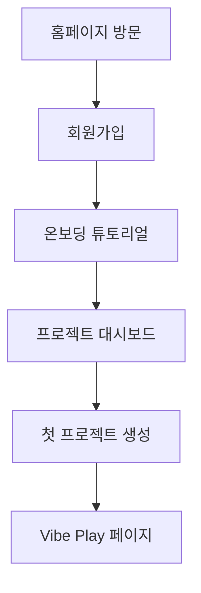
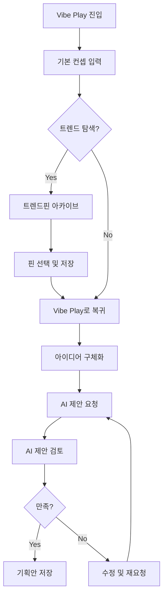
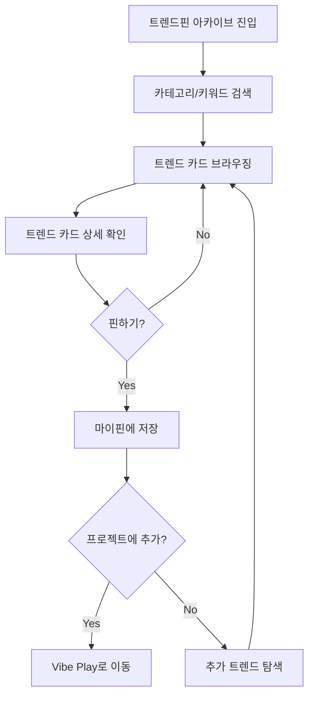
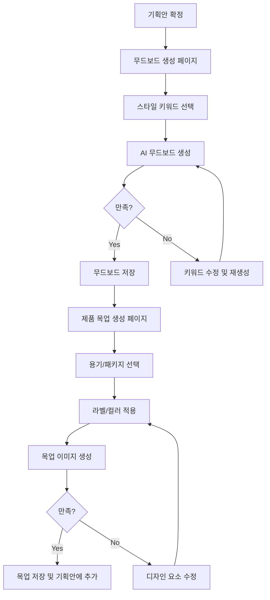
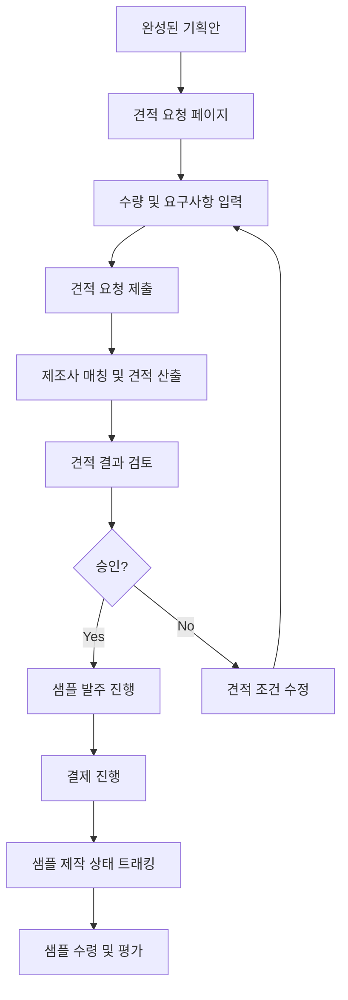

# 바이브-플레이(Vibe-Play) 사용자 플로우

## 1. 신규 사용자 온보딩

### 상세 단계:
1. **홈페이지 방문**: 사용자가 플랫폼 가치 제안 확인
2. **회원가입**: 이메일/소셜 로그인으로 간편 가입
3. **온보딩 튜토리얼**: 핵심 기능 3단계 소개 (선택적 스킵 가능)
4. **프로젝트 대시보드**: 비어있는 대시보드 표시 및 첫 프로젝트 생성 유도
5. **첫 프로젝트 생성**: 간단한 양식으로 기본 정보 입력
6. **Vibe Play 페이지**: 직관적 인터페이스로 컨셉 구체화 시작

## 2. 제품 컨셉 개발 흐름

### 상세 단계:
1. **Vibe Play 진입**: 프로젝트 대시보드에서 신규/기존 프로젝트 선택
2. **기본 컨셉 입력**: 제품 유형, 타겟 고객, 핵심 키워드 입력
3. **트렌드 탐색 (선택사항)**: 트렌드핀 아카이브로 이동하여 참고할 트렌드 검색
4. **핀 선택 및 저장**: 관심 트렌드를 마이핀에 저장
5. **Vibe Play로 복귀**: 저장한 핀 정보를 기획에 활용
6. **아이디어 구체화**: 텍스트 입력과 핀 조합으로 아이디어 발전
7. **AI 제안 요청**: 입력된 정보를 바탕으로 AI에 제안 생성 요청
8. **AI 제안 검토**: 제품명, 컨셉, 성분, 디자인 제안 확인
9. **만족/불만족**: 제안 내용 수락 또는 수정 후 재요청
10. **기획안 저장**: 완성된 기획안 저장 및 프로젝트 진행

## 3. 트렌드 탐색 및 핀 관리 흐름

### 상세 단계:
1. **트렌드핀 아카이브 진입**: 네비게이션 메뉴에서 접근
2. **카테고리/키워드 검색**: 성분, 제형, 디자인, 컨셉 등 관심 영역 필터링
3. **트렌드 카드 브라우징**: 시각적으로 매력적인 카드 형태로 표시된 트렌드 정보 탐색
4. **트렌드 카드 상세 확인**: 관심 카드 클릭하여 상세 정보 확인
5. **핀하기**: 유용한 트렌드 정보를 마이핀에 저장
6. **프로젝트 연결**: 특정 프로젝트에 즉시 적용하거나 추후 활용을 위해 저장
7. **추가 탐색**: 지속적인 트렌드 발굴 및 관심 정보 수집

## 4. 무드보드 및 목업 생성 흐름 (Phase 2)

### 상세 단계:
1. **기획안 확정**: 기본 제품 컨셉 및 요소가 확정된 상태
2. **무드보드 생성 페이지**: 시각적 무드보드 제작 화면으로 전환
3. **스타일 키워드 선택**: 디자인 방향을 정의하는 키워드 선택 (우아한, 미니멀, 자연적 등)
4. **AI 무드보드 생성**: AI가 키워드 기반으로 무드보드 이미지 생성
5. **무드보드 저장**: 만족스러운 무드보드 저장 및 기획안에 연결
6. **제품 목업 단계**: 실제 제품 외관 시각화 단계로 진행
7. **용기/패키지 선택**: 라이브러리에서 적합한 용기 유형 선택
8. **라벨/컬러 적용**: 브랜드 요소 적용 및 컬러 커스터마이징
9. **목업 이미지 생성**: AI 기반으로 실제적인 제품 이미지 생성
10. **저장 및 기획안 완성**: 최종 목업을 저장하고 기획안 완성

## 5. 견적 및 샘플 발주 흐름 (Phase 3)

### 상세 단계:
1. **완성된 기획안**: 제품 컨셉, 성분, 디자인이 확정된 상태
2. **견적 요청**: 수량, 특별 요구사항 등 상세 정보 입력
3. **제조사 매칭**: 알고리즘으로 최적의 제조사 자동 매칭
4. **견적 산출**: 실시간 또는 24시간 이내 견적 제공
5. **견적 검토/승인**: 여러 견적안 비교 및 선택
6. **샘플 발주**: 소량 샘플 발주 진행
7. **제작 상태 트래킹**: 실시간 진행 상태 확인
8. **샘플 평가**: 수령 후 품질 평가 및 피드백